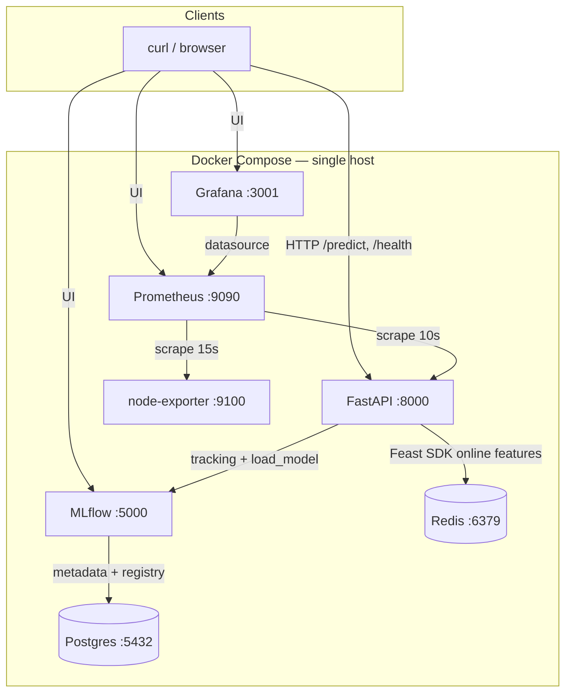
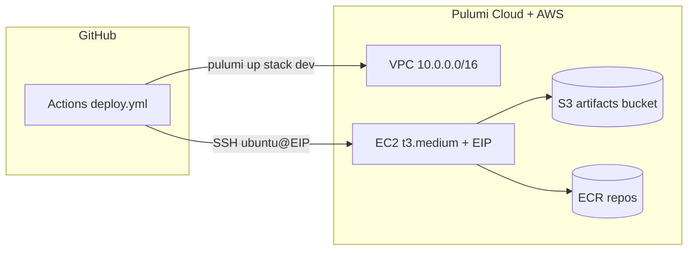

# ModelServe — Engineering Documentation

> **This document is a major graded deliverable (19 marks).** It must be complete,
> accurate, and detailed enough that another engineer could understand and
> reproduce the system without looking at the code.

This repository implements **ModelServe**: an end-to-end MLOps capstone that trains a fraud classifier, registers it in **MLflow**, serves **online features** through **Feast** (Redis), exposes inference via **FastAPI**, and observes the stack with **Prometheus** and **Grafana**. The same **Docker Compose** topology runs on a developer machine (Poridhi VM / laptop) and on **AWS EC2** (`ap-southeast-1`), provisioned by **Pulumi** and deployed from **GitHub Actions**.

**Companion docs:** short overview in [`architecture-summary.md`](architecture-summary.md); operations in [`final-runbook.md`](final-runbook.md); secrets in [`github-secrets.md`](github-secrets.md).

---

## 1. System Overview

### 1.1 Purpose and users

ModelServe answers: *“Given a credit-card identifier (`cc_num`), what is the fraud risk using the latest trained model and the feature vector we agreed on at training time?”*

- **Primary consumers:** HTTP clients calling **`POST /predict`** with `{"entity_id": <int>}` where `entity_id` maps to Feast’s entity **`cc_num`** (Kaggle fraud-detection schema).
- **Operators:** course assessors, teammates, and you during demo — using MLflow UI, Grafana, Prometheus, and SSH/Compose on the host.

The system is educational and demo-oriented: one logical “production line” (train → register → materialize → serve → observe) with **explicit** trade-offs (single node, open ingress ports on EC2 for lab access) rather than maximum isolation or cost optimization.

### 1.2 Design philosophy

| Principle | How it shows up here |
|------------|----------------------|
| **Reproducibility** | MLflow tracks runs and pins **Production** model name `modelserve_classifier`; Feast definitions + Parquet export align training and serving feature columns. |
| **Train/serve alignment** | Features at inference come from **Feast SDK** → Redis, not ad-hoc SQL or raw Redis keys — same schema as offline export after materialization. |
| **Operational transparency** | Prometheus scrapes API and node-exporter; alert rules encode simple SLO-style signals (latency, error rate, scrape health). |
| **Scope vs complexity** | **Docker Compose on one host** instead of Kubernetes: full stack is inspectable and fits course timelines; EKS/managed Redis would add ops overhead out of scope. |

### 1.3 Tech stack and deployment model

| Layer | Choices |
|--------|---------|
| **Training** | Python 3.10+, scikit-learn pipeline, Kaggle `fraudTrain.csv` (not committed). |
| **Experiment / registry** | MLflow tracking + model registry; backend **PostgreSQL 15**; artifacts stored in MLflow server volume (`--serve-artifacts`). |
| **Feature store** | Feast repo under `feast_repo/`; **Redis 7** as online store; offline features exported to `training/features.parquet` then **materialized** into Redis. |
| **Serving** | **FastAPI** (`api/`): loads Production model at startup; `/predict` runs sklearn pipeline after fetching online features. |
| **Observability** | **Prometheus** scrapes `/metrics` on the API and node-exporter; **Grafana** provisions dashboards from repo files. |
| **Packaging** | Multi-service **Docker Compose**; custom images for API (`Dockerfile`) and MLflow (`docker/mlflow/Dockerfile` for `psycopg2`). |
| **Cloud** | **Pulumi** (Python) defines VPC, public subnet, security group, **t3.medium** EC2, **Elastic IP**, **S3** artifact bucket, **ECR** repos (`modelserve-api`, `modelserve-mlflow`). |
| **CI/CD** | **GitHub Actions**: push to `main` → `pulumi up` (stack `dev`) → SSH to EC2 → `deploy_ec2_pipeline.sh` (clone, Kaggle download, `deploy_ec2.sh`). Destroy workflow is manual (`workflow_dispatch`). |

**Deployment model:** *single EC2 instance* runs the Compose stack (or equivalent manual steps). There is no separate inference fleet or auto-scaling group in this capstone.

---

## 2. Architecture Diagram(s)

### 2.1 Logical architecture (runtime)

Services communicate inside a Docker bridge network (`modelserve`). Host-published ports expose UIs and API for demos.

**Protocols:** HTTP for MLflow REST/UI and API; PostgreSQL wire protocol for MLflow backend; Redis protocol for Feast online store; Prometheus pull scraping.

### 2.2 AWS topology (CI + EC2)

Pulumi creates network and compute in **ap-southeast-1**; GitHub Actions drives deploy after `pulumi up`.

- **Security group ingress:** TCP **22** (SSH), **8000** (API), **5000** (MLflow), **3001** (Grafana), **9090** (Prometheus) from `0.0.0.0/0` — suitable for a **lab/demo**; production would restrict sources and add TLS/WAF.

### 2.3 Data and model path (two planes)

**Offline (training):** `data/raw/fraudTrain.csv` → `training/train.py` → MLflow run + register **`modelserve_classifier`** @ **Production** → writes **`training/features.parquet`** + sample request JSON → `feast -c feast_repo apply` → `scripts/materialize_features.py` → **Redis** keys for entities present in the export.

**Online (inference):** Client → **`POST /predict`** → Feast **`get_online_features`** for `entity_id` (= `cc_num`) → build DataFrame row → sklearn **Pipeline** `predict` / `predict_proba` → JSON response + timestamps.

**Diagram note:** For hand-drawn or Excalidraw assets, you can add images under `docs/diagrams/` and reference them here; the Mermaid diagrams above satisfy the rubric requirement for at least one diagram.

---

## 3. Architecture Decision Records (ADRs)

### ADR-1: Deployment topology — single EC2 + Compose vs EKS / managed services

**Context:** The capstone must demonstrate training, registry, feature store, serving, and monitoring without unlimited cloud budget or team size.

**Decision:** Deploy the full stack as **Docker Compose on one EC2 instance** (local dev mirrors the same Compose file). **Pulumi** provisions VPC, subnet, SG, EC2, EIP, S3, ECR; CI runs **`deploy_ec2_pipeline.sh`** after `pulumi up`.

**Rationale:** One host keeps networking, logs, and failure modes understandable. Compose matches “production-like” enough for grading while avoiding Kubernetes bootstrap, ingress controllers, and multi-node Feast/Redis HA.

**Trade-offs:** No horizontal scaling for API or Redis; EC2 outage takes everything down; open ports on SG are a security smell outside a classroom VPC.

---

### ADR-2: CI/CD strategy — Pulumi up + remote pipeline vs blue/green

**Context:** Need repeatable deploy from Git **main** with infrastructure as code and a known bootstrap on the instance.

**Decision:** On **push to `main`**, GitHub Actions runs **`pulumi up --yes`** on stack **`dev`**, waits until **Docker** is ready on EC2, then **SCP + SSH** to execute **`deploy_ec2_pipeline.sh`** (clone repo, Kaggle credentials, `deploy_ec2.sh`). **Destroy** is a separate **manual** workflow (`destroy.yml`, `workflow_dispatch`). **Concurrency group** `deploy-main` prevents overlapping deploys from stomping state (`cancel-in-progress: false`).

**Rationale:** Declarative infra (Pulumi) + imperative bootstrap script matches team familiarity and keeps the “destroy stack” path explicit for cost control.

**Trade-offs:** Not immutable blue/green; in-place updates depend on script idempotency; long-running `pulumi up` + SSH can fail mid-way (operator follows [`final-runbook.md`](final-runbook.md) and Pulumi logs).

---

### ADR-3: Data architecture — Postgres, Redis, S3, MLflow artifacts

**Context:** MLflow needs durable metadata; Feast online serving needs low-latency key lookups; course asks for cloud artifact story.

**Decision:**

- **PostgreSQL** for MLflow **backend store** (experiments, params, registry transitions).
- **Redis** with AOF (`--appendonly yes`) for Feast **online store** (entity-keyed feature rows).
- **MLflow artifact storage** on the MLflow container volume via **`--serve-artifacts`** and **`--artifacts-destination /mlflow/artifacts`** so **host-side** `training/train.py` uploads over HTTP instead of broken `file:/` paths.
- **S3 bucket** created by Pulumi for **capstone continuity** (artifacts/CI patterns); the default local path uses volume-backed MLflow as in [`docker-compose.yml`](../docker-compose.yml).

**Rationale:** OLTP semantics fit MLflow’s registry; Redis matches Feast’s documented online store patterns; separating “registry metadata” (Postgres) from “feature lookups” (Redis) avoids overloading one DB.

**Trade-offs:** Two data stores to backup/reset; S3 in AWS may be underused if all runs stay local — document actual usage in your demo.

---

### ADR-4: Containerization — base images and MLflow custom image

**Context:** API must load MLflow models and Feast; MLflow server needs PostgreSQL driver.

**Decision:**

- **API image:** project **`Dockerfile`** (Python slim base, app code, non-root where configured per repo).
- **MLflow image:** **`docker/mlflow/Dockerfile`** extends the need for **`psycopg2`** because stock images may not include Postgres support for `--backend-store-uri postgresql://...`.
- **Compose** builds tag **`modelserve-mlflow:local`** and **`modelserve-api:local`**.

**Rationale:** Pin versions in Compose where possible; custom MLflow build avoids runtime pip installs on EC2 host.

**Trade-offs:** Larger image build times; must rebuild when changing MLflow dependencies.

---

### ADR-5: Monitoring design — scrape intervals and alerts

**Context:** Need latency and reliability signals for demo SLO narrative without running a full incident management stack.

**Decision:**

- **Prometheus** global scrape **15s**; **API** job **`modelserve-api`** overrides to **10s** for fresher RED-style metrics; **node-exporter** at **15s** ([`monitoring/prometheus/prometheus.yml`](../monitoring/prometheus/prometheus.yml)).
- **Alert rules** ([`monitoring/prometheus/alerts.yml`](../monitoring/prometheus/alerts.yml)):
  - **ModelServeHighPredictionLatencyP95:** p95 of `prediction_duration_seconds` &gt; **2s** for **5m** (warning).
  - **ModelServeHighPredictionErrorRate:** error rate &gt; **10%** over **5m** (warning).
  - **ModelServeAPIDown:** `up{job="modelserve-api"} == 0` for **1m** (critical).

**Rationale:** Histogram quantile captures tail latency for user-facing `/predict`; error ratio uses `prediction_errors_total` / `prediction_requests_total`; `up` catches total scrape failure.

**Trade-offs:** Thresholds are **lab-tuned** — production would baseline from traffic; no long-term storage or Thanos; Grafana alerting not mandatory if Prometheus alerts suffice for the rubric.

---

## 4. CI/CD Pipeline Documentation

### 4.1 Workflow: `Deploy (Pulumi + EC2)` (`.github/workflows/deploy.yml`)

| Aspect | Detail |
|--------|--------|
| **Trigger** | **Push** to branch **`main`** |
| **Runner** | `ubuntu-latest` |
| **Concurrency** | Group **`deploy-main`**, `cancel-in-progress: false` |
| **Main steps** | Checkout → setup Python 3.10 → **configure-aws-credentials** → install Pulumi CLI → in **`infrastructure/`**: create venv, `pip install -r requirements.txt`, `pulumi login`, select or **init** stack **`dev`**, `pulumi config set aws:region ap-southeast-1`, **`pulumi config set sshPublicKey`**, **`pulumi up --yes`** |
| **Post-provision** | Read **`pulumi stack output instance_public_ip`** → write private SSH key from **`SSH_PRIVATE_KEY`** → **`ssh-keyscan`** → loop until **`sudo docker info`** succeeds (up to **60** × **10s**) |
| **Remote deploy** | **`scp`** `scripts/deploy_ec2_pipeline.sh` → **`ssh`** run with **`MODELSERVE_REPO_URL`**, **`MODELSERVE_BRANCH`**, **`KAGGLE_USERNAME`**, **`KAGGLE_KEY`** |

### 4.2 Workflow: `Destroy` (`.github/workflows/destroy.yml`)

| Aspect | Detail |
|--------|--------|
| **Trigger** | **Manual** `workflow_dispatch` |
| **Behavior** | Same AWS + Pulumi bootstrap → **`pulumi destroy --yes`** on stack **`dev`**; on partial failures, operator may need **`pulumi state delete`** for stuck URNs (see workflow logs and [`final-runbook.md`](final-runbook.md)). |

### 4.3 Required secrets (mandatory)

See full table in [`github-secrets.md`](github-secrets.md). Minimum for deploy:

- `AWS_ACCESS_KEY_ID`, `AWS_SECRET_ACCESS_KEY`, `AWS_REGION`
- `PULUMI_ACCESS_TOKEN`
- `SSH_PUBLIC_KEY`, `SSH_PRIVATE_KEY` (matching pair)
- `KAGGLE_USERNAME`, `KAGGLE_KEY`

Optional: `PULUMI_CONFIG_PASSPHRASE` if stack config is encrypted.

### 4.4 Failure handling and timing

- **Empty `SSH_PUBLIC_KEY`:** workflow fails fast before `pulumi up`.
- **Docker not ready on EC2:** step exits non-zero after ~10 minutes — fix user-data / instance health and rerun.
- **SSH/SCP failure:** wrong keypair, SG, or IP — verify Pulumi outputs vs AWS console.
- **End-to-end time:** highly variable (first `pulumi up` + AMI/docker install + Kaggle download + train); budget **15–45+ minutes** for a cold CI path; incremental pushes may be faster if stack exists and pipeline skips heavy steps depending on script behavior.

---

## 5. Runbook

This section is the **architecture-grade** summary; step-by-step commands live in [`final-runbook.md`](final-runbook.md) and [`README.md`](../README.md).

### 5.1 Bootstrapping from a fresh clone

1. **Clone** repository; copy **`.env.example`** → **`.env`**.
2. **Local full stack:** `docker compose up -d --build` (optional: only `postgres`, `redis`, `mlflow` first for training).
3. **Python venv** + `pip install -r requirements.txt`; place **`data/raw/fraudTrain.csv`**.
4. **`python scripts/wait_for_mlflow.py`** → **`python training/train.py`** → **`feast -c feast_repo apply`** → **`python scripts/materialize_features.py`**.
5. Bring up **API + monitoring**; verify **`/health`**, **`/predict`**, Prometheus **targets**, Grafana.

**Secrets (AWS/CI):** configure GitHub secrets per [`github-secrets.md`](github-secrets.md) before first **`main`** deploy.

### 5.2 Deploying a new model version

1. Retrain with **`training/train.py`** (optionally new params / row cap via env).
2. Transition or rely on script registering **Production** for **`modelserve_classifier`** (per your training script).
3. Regenerate Parquet if features changed; **`feast apply`** + **`materialize_features.py`**.
4. **Restart API** container so it reloads Production model if your process loads once at startup (`docker compose up -d --build api` or full compose restart).

### 5.3 Common failure recovery

| Symptom | Direction |
|---------|-----------|
| **API unhealthy / no model** | Check MLflow UI — Production artifact exists; API logs; **`MLFLOW_TRACKING_URI`** inside container points to **`http://mlflow:5000`**. |
| **403/permission on MLflow from host training** | Ensure MLflow uses **`--serve-artifacts`** (see [`docker-compose.yml`](../docker-compose.yml)); restart MLflow. |
| **Missing features on `/predict`** | Entity not in Redis — re-run materialize; use **`entity_id`** from **`training/sample_request.json`**. |
| **Prometheus target down** | Network DNS **`api`** inside Compose; service name must match **`prometheus.yml`**. |
| **Pulumi destroy stuck** | Follow printed URNs; `pulumi state delete`; avoid deleting live resources outside Pulumi without reconciling state. |
| **Redis empty after reboot** | Persistence is AOF; if volume wiped, re-run materialize. |

### 5.4 Teardown

- **Local:** `docker compose down` (optional **`-v`** to drop volumes — destructive).
- **AWS:** GitHub **Destroy** workflow or local **`pulumi destroy`** on stack **`dev`** after emptying ECR if policy requires ([`final-runbook.md`](final-runbook.md) §8).

---

## 6. Known Limitations

1. **Single point of failure:** One EC2 instance hosts API, Redis, MLflow, and monitoring — no HA or multi-AZ.
2. **Security posture:** Wide ingress on SG; HTTP only on service ports; no OIDC for MLflow; dataset contains sensitive patterns — **not** GDPR/PCI production-ready.
3. **Feature staleness:** Online features reflect last **materialization** — no real-time streaming ingest in this capstone.
4. **Model governance:** No automated canary, shadow traffic, or approval workflow beyond MLflow stage transitions.
5. **Cost / cleanup:** Forgotten stacks incur EC2/EIP/S3 cost; destroy workflow and **`force_destroy`** on bucket aid teardown but require discipline.
6. **Scope shortcuts:** Tests, deeper IaC for RDS/ElastiCache, and enterprise SSO are out of scope unless you extend the repo.

---

## 7. How to reproduce without reading code (checklist)

| Step | Artifact / command |
|------|---------------------|
| Infra | `cd infrastructure && pulumi stack select dev && pulumi up` (with AWS creds and `sshPublicKey` set). |
| Stack | `docker compose up -d --build` on host or EC2 after clone. |
| Train | `python training/train.py` with `MLFLOW_TRACKING_URI` pointing at running MLflow. |
| Feast | `feast -c feast_repo apply` + `python scripts/materialize_features.py`. |
| Verify | `curl` **`/health`**, **`/predict`**; open MLflow + Grafana; check Prometheus **Alerts** page. |

---

*Document version aligns with ModelServe capstone Phases 1–14. Update ADRs if you change topology or security model.*
