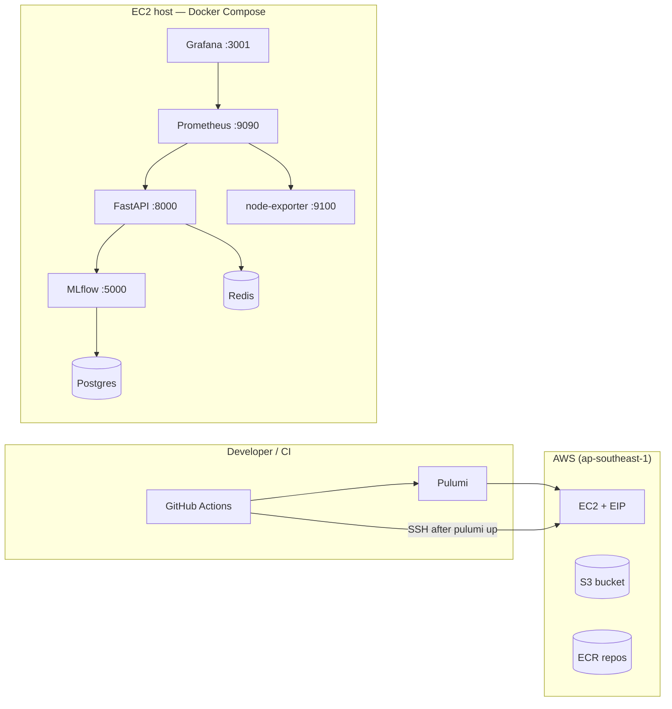

# ModelServe — Architecture summary (Phase 13)

This document is a **short** companion to the deeper template in [`ARCHITECTURE.md`](ARCHITECTURE.md). It captures the **end-to-end flow** as implemented in this repo.

---

## 1. What the system does

- **Train** a fraud classifier on the Kaggle dataset, **register** the model in **MLflow** (Production), and export **Feast-ready** features to Parquet.
- **Serve** predictions via **FastAPI** (`POST /predict`), loading the model from MLflow once at startup and reading **online features** through the **Feast SDK** (Redis online store).
- **Observe** latency, errors, and Feast hit/miss metrics with **Prometheus** and **Grafana**.
- **Deploy** the same Docker Compose stack on **AWS EC2** (single host) using **Pulumi** + **GitHub Actions**.

---

## 2. High-level architecture flow

**Data / model flow (runtime)**

1. Client calls **`POST /predict`** with `{"entity_id": <cc_num>}`.
2. **Feast** reads the latest feature row for that **entity** from the **Redis** online store (populated by **materialize** from `training/features.parquet`).
3. **FastAPI** builds the model input frame (numeric features from Feast + default categoricals for columns the sklearn pipeline still expects), runs **MLflow-loaded** sklearn pipeline **predict / predict_proba**.
4. Response includes `prediction`, `fraud_probability`, `model_version`, timestamps.

**Training flow (offline)**

1. Raw CSV under `data/raw/` → `training/train.py` → MLflow experiment + **registry** `modelserve_classifier` @ **Production** → writes `training/features.parquet` and `training/sample_request.json`.
2. `feast -c feast_repo apply` → `python scripts/materialize_features.py` → Redis online store updated for entity keys present in the export.

---

## 3. Component roles (single EC2 / local VM)

| Component | Role |
|-----------|------|
| **Postgres** | MLflow backend store (experiments, registry metadata). |
| **Redis** | Feast online store for low-latency feature reads at inference. |
| **MLflow** | Experiment tracking, model registry, artifact storage (served from container). |
| **FastAPI** | HTTP API: `/health`, `/metrics`, `/predict`. |
| **Prometheus** | Scrapes `/metrics` (10s) and node-exporter (15s); evaluates alert rules. |
| **Grafana** | Dashboards + Prometheus datasource (file provisioning). |
| **node-exporter** | Host metrics for dashboards/alerts. |
| **S3 / ECR (AWS)** | Artifact and image storage **outside** the hot path of local-only dev; created by Pulumi for capstone continuity. |

---

## 4. Network boundaries

- **Inside Compose**: services talk by **DNS name** (`mlflow`, `redis`, `postgres`, `api`).
- **On the host / EC2 public IP**: browsers and `curl` use **published ports** (e.g. 8000, 5000, 3001, 9090).
- **Training scripts on the host** use `MLFLOW_TRACKING_URI=http://127.0.0.1:5000` (see `.env.example`); the **API container** uses `http://mlflow:5000`.

---

## 5. MLflow vs Feast (short)

| | **MLflow** | **Feast** |
|---|------------|-----------|
| **Purpose** | Model lifecycle: runs, metrics, **registry**, loading Production model in the API. | **Feature store**: definitions of entities/views + offline Parquet + **online** Redis serving. |
| **Inference** | `mlflow.sklearn.load_model("models:/modelserve_classifier/Production")`. | `FeatureStore(repo_path=…).get_online_features(...)` — **no direct Redis reads** in app code. |
| **This repo** | Model name **`modelserve_classifier`**, stage **Production**. | Entity **`cc_num`**, feature view **`fraud_txn_features`**, numeric columns aligned with `training/feature_schema.py`. |

---

## 6. Cross-references

| Topic | Document |
|--------|----------|
| Operations & recovery | [`final-runbook.md`](final-runbook.md) |
| Demo / presentation | [`demo-guide.md`](demo-guide.md) |
| Errors & fixes | [`troubleshooting.md`](troubleshooting.md) |
| CI secrets detail | [`github-secrets.md`](github-secrets.md) |
| Full engineering template | [`ARCHITECTURE.md`](ARCHITECTURE.md) |
