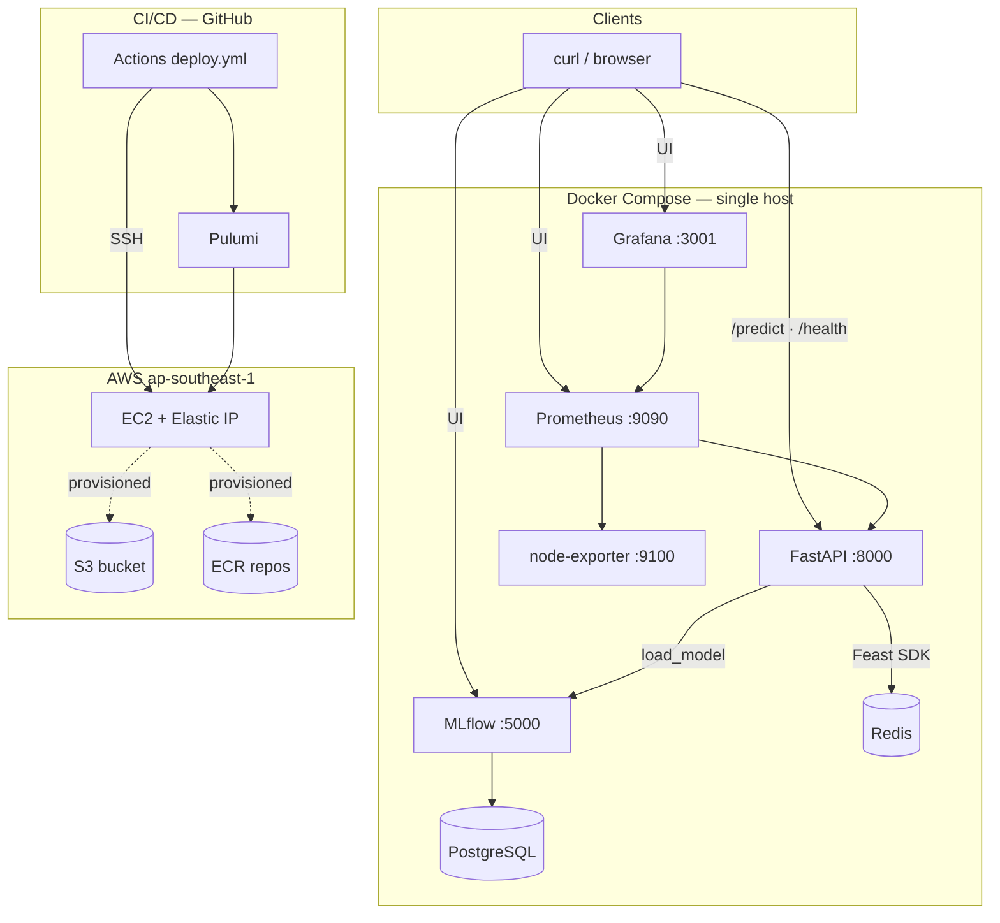
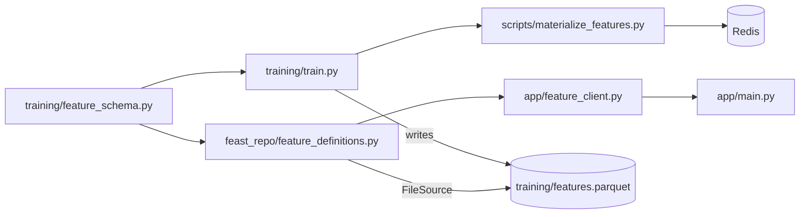
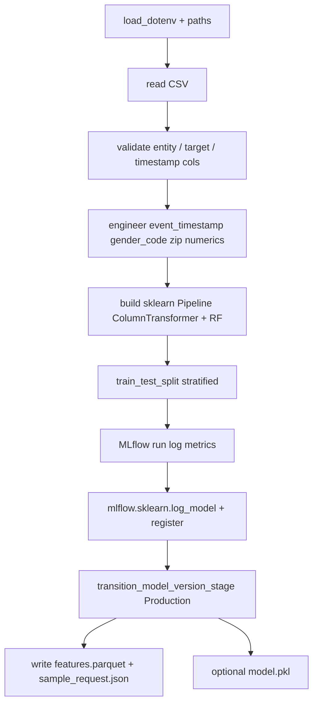
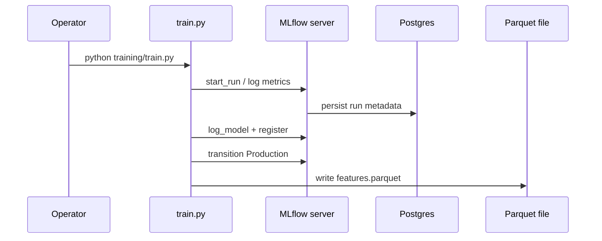
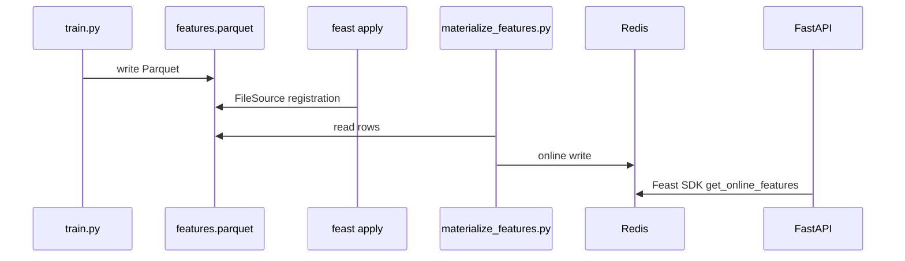
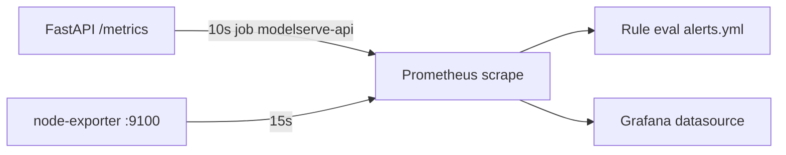
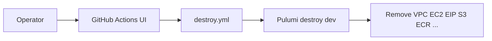
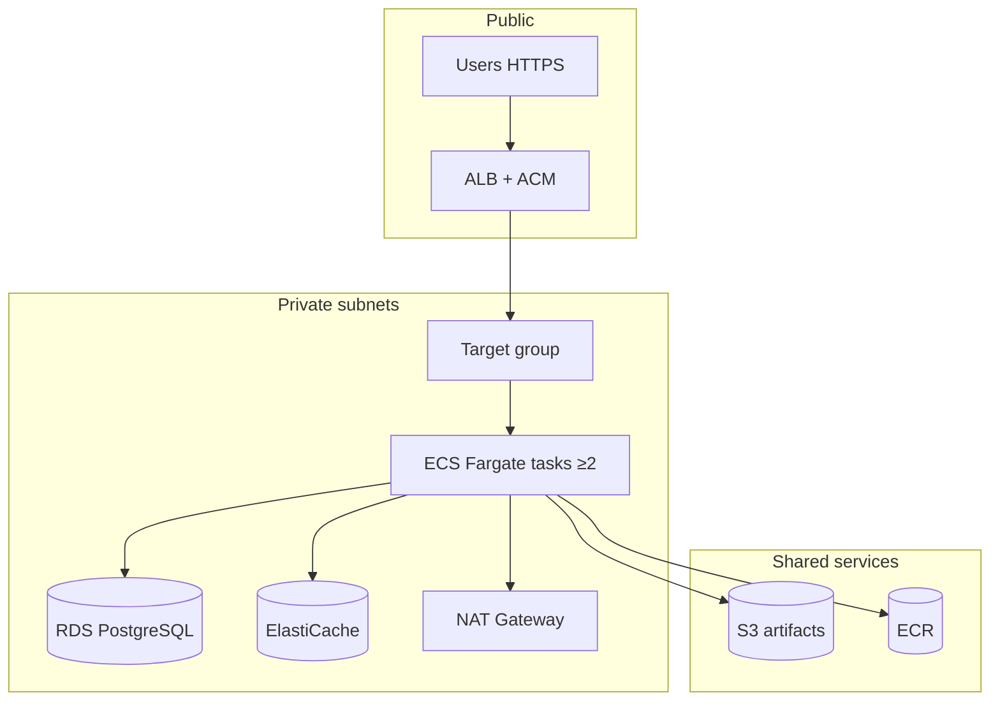
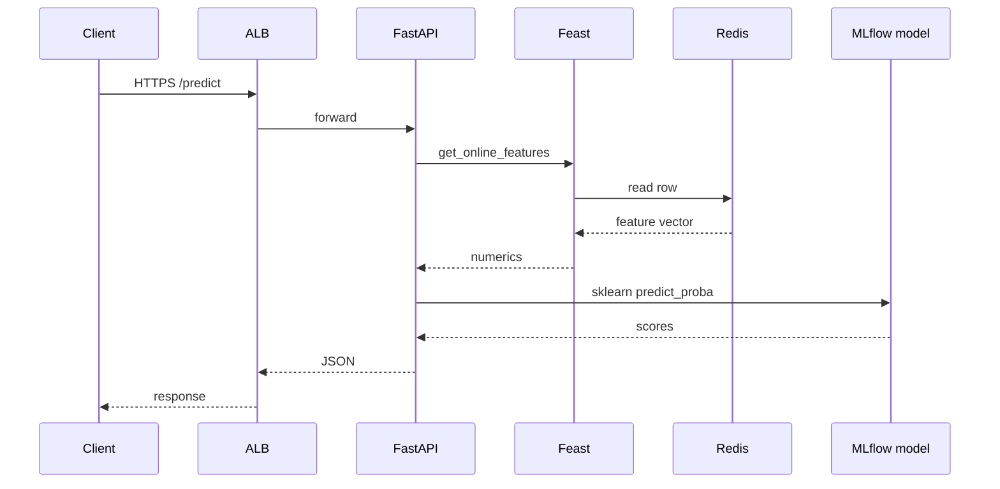
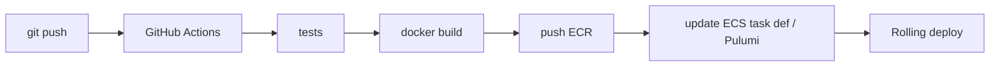

# ModelServe: From Notebook to MLOps on AWS — A Complete Technical Guide

> **Audience:** DevOps, MLOps, backend, and platform engineers; students moving toward production ML systems.  
> **Source of truth:** This repository (ModelServe capstone, Poridhi MLOps S2). All paths are relative to repo root unless stated.  
> **Disclaimer:** AWS pricing and service limits change; production numbers in §13 are **BOTEC** — validate with the [AWS Pricing Calculator](https://calculator.aws/).

---

## Table of contents

| # | Section |
|---|---------|
| 1 | [Introduction](#1-introduction) |
| 2 | [High-level architecture](#2-high-level-architecture) |
| 3 | [Project structure deep dive](#3-project-structure-deep-dive) |
| 4 | [Dataset and feature engineering](#4-dataset-and-feature-engineering) |
| 5 | [Training pipeline deep dive](#5-training-pipeline-deep-dive) |
| 6 | [MLflow deep dive](#6-mlflow-deep-dive) |
| 7 | [Feast feature store deep dive](#7-feast-feature-store-deep-dive) |
| 8 | [Serving and inference flow](#8-serving-and-inference-flow) |
| 9 | [Monitoring and observability](#9-monitoring-and-observability) |
| 10 | [Infrastructure and deployment](#10-infrastructure-and-deployment) |
| 11 | [CI/CD pipeline deep dive](#11-cicd-pipeline-deep-dive) |
| 12 | [Production readiness discussion](#12-production-readiness-discussion) |
| 13 | [BOTEC and AWS cost estimation](#13-botec-and-aws-cost-estimation) |
| 14 | [Comparative technology discussion](#14-comparative-technology-discussion) |
| 15 | [Future improvements](#15-future-improvements) |
| 16 | [Final production architecture](#16-final-production-architecture) |
| 17 | [Conclusion](#17-conclusion) |

---

## 1. Introduction

### 1.1 Project goal

**ModelServe** is an end-to-end MLOps capstone: train a **fraud classifier** on tabular transaction data, **register** the model in **MLflow**, **serve online features** through **Feast** backed by **Redis**, expose **HTTP inference** with **FastAPI**, and **observe** the system with **Prometheus** and **Grafana**. The same **Docker Compose** stack runs locally and on a single **AWS EC2** instance in **`ap-southeast-1`**, provisioned by **Pulumi** and updated from **GitHub Actions** on push to `main`.

### 1.2 Why fraud detection is a strong MLOps use case

Fraud scoring forces **real engineering concerns** early:

| Concern | Why it matters |
|---------|----------------|
| **Imbalance** | Accuracy is misleading; precision/recall and operating points matter. |
| **Train/serve alignment** | The same feature definitions must exist at training and request time. |
| **Latency** | Online inference expects sub-second paths; batch-only features are not enough without materialization. |
| **Governance** | Model versions, audit trails (MLflow runs), and observability (metrics) map to production expectations. |

### 1.3 Why production MLOps is not “notebook ML”

Notebook-centric work optimizes for **exploration**. Production MLOps optimizes for **repeatability, isolation, deployability, and failure modes**:

| Notebook ML | Production MLOps (this repo’s direction) |
|--------------|-------------------------------------------|
| Ad-hoc paths and env | **Compose**, **`.env.example`**, pinned images |
| “Works on my machine” | **CI/CD**, remote **EC2** pipeline, health checks |
| Implicit feature columns | **Feast** definitions + **shared** `feature_schema.py` |
| Pickle on disk | **MLflow** registry + **version** surfaced in API |
| Print debugging | **Prometheus** metrics + **Grafana** dashboards + **alerts** |

The capstone intentionally stops short of full HA and private networking; §12 and §16 document the **evolution path**.

---

## 2. High-level architecture

### 2.1 End-to-end Mermaid diagram (runtime + CI touchpoints)



**Note on dashed lines:** S3 and ECR exist in Pulumi (`infrastructure/__main__.py`) for continuity; the **default** runtime builds images on EC2 and stores MLflow artifacts in a **Docker volume** — see [`production-readiness.md`](production-readiness.md).

### 2.2 Component roles and interactions

| Component | Role in ModelServe | Interacts with |
|-----------|-------------------|----------------|
| **FastAPI** | HTTP API: `/health`, `/metrics`, `POST /predict` | MLflow (model), Feast client → Redis, Prometheus client library |
| **MLflow** | Tracking UI + model registry; artifact server | PostgreSQL backend store; volume for artifacts in Compose |
| **Feast** | Declarative feature definitions + SDK | `feast_repo/`, `training/features.parquet`, Redis online store |
| **Redis** | Online key-value store for Feast materialized rows | Feast materialization + `get_online_features` |
| **PostgreSQL** | MLflow metadata (runs, params, registry) | MLflow server only |
| **Prometheus** | Scrapes `/metrics` and node-exporter | Grafana datasource |
| **Grafana** | Dashboards (provisioned JSON) | Prometheus |
| **Docker Compose** | Single-host orchestration | All runtime containers |
| **Pulumi** | IaC: VPC, subnet, SG, EC2, EIP, S3, ECR | AWS API |
| **GitHub Actions** | `pulumi up` + SSH deploy pipeline | Pulumi Cloud token, AWS keys, SSH keys, Kaggle secrets |

### 2.3 Why these pieces fit together

- **Postgres + MLflow:** transactional metadata fits experiment lineage and registry transitions.
- **Redis + Feast:** low-latency entity lookups without hand-rolled Redis key strings in application code.
- **Prometheus + Grafana:** RED-style metrics for `/predict` plus host signals from node-exporter.
- **Pulumi + Actions:** declarative infra plus scripted bootstrap matches many teams’ “IaC + imperative last mile” pattern.

---

## 3. Project structure deep dive

### 3.1 Important directories

| Path | Purpose |
|------|---------|
| `app/` | FastAPI app: `main.py`, `model_loader.py`, `feature_client.py`, `metrics.py` |
| `training/` | `train.py`, `feature_schema.py`, exported `features.parquet`, `sample_request.json` |
| `feast_repo/` | `feature_definitions.py`, `feature_store.yaml` — Feast project |
| `scripts/` | `wait_for_mlflow.py`, `materialize_features.py`, `deploy_ec2.sh`, `deploy_ec2_pipeline.sh`, `bootstrap_ec2.sh` |
| `monitoring/` | Prometheus and Grafana provisioning |
| `infrastructure/` | Pulumi Python (`__main__.py`) |
| `.github/workflows/` | `deploy.yml`, `destroy.yml` |
| `docker/` | Custom **MLflow** Dockerfile (`psycopg2` for Postgres backend) |

### 3.2 Cross-package relationships



- **`feature_schema.py`** is the **contract**: entity id, timestamps, and `FEAST_NUMERIC_FEATURE_COLS` must stay aligned across `train.py`, Feast definitions, and `feature_client.py` (which duplicates the numeric list for row assembly).

### 3.3 How files reference one another (selected)

| From | To | Mechanism |
|------|-----|-----------|
| `train.py` | `feature_schema.py` | Python import |
| `feature_definitions.py` | `training/features.parquet` | `FileSource(path=...)` |
| `materialize_features.py` | Feast repo | `feast -c feast_repo` / FeatureStore API |
| `model_loader.py` | MLflow | `models:/modelserve_classifier/Production` |
| `feature_client.py` | Feast + Redis | `FeatureStore`, `get_online_features`; may patch YAML for Docker `REDIS_URL` |
| `prometheus.yml` | API | scrape target `api:8000` |

---

## 4. Dataset and feature engineering

### 4.1 Kaggle dataset

- **Dataset (authoritative listing):** [Credit Card Transactions Fraud Detection — kartik2112/fraud-detection](https://www.kaggle.com/datasets/kartik2112/fraud-detection) on Kaggle. The bundle is **not committed** here; large CSVs stay under `data/raw/` and are **gitignored** so clones stay small.
- **Primary training file:** `fraudTrain.csv` → expected at `data/raw/fraudTrain.csv` (or override with `FRAUD_TRAIN_PATH`).
- **`fraudTest.csv`:** often shipped alongside `fraudTrain.csv` for a **held-out** test file in competitions and tutorials. **ModelServe** does **not** read `fraudTest.csv` by default: `training/train.py` loads **`fraudTrain.csv`** and performs an **internal stratified 80/20 split** for metrics and model fitting.

**What the dataset represents (context from public write-ups of similar “synthetic credit card fraud” bundles on Kaggle):** each row is usually **one authorized transaction attempt** tied to a **card** (`cc_num`), with a wall-clock time, purchase amount, coarse geography (cardholder city/zip vs merchant location), and a **binary fraud label**. Many of these datasets are **synthetically generated** (for example Sparkov-style generators discussed on Kaggle and in EDA notebooks), so fields are **clean and complete** compared with raw issuer logs — good for teaching pipelines, not a substitute for production fraud analytics.

**Semantic guide — columns ModelServe actually trains on or derives** (meanings are **schema-level**; see the [dataset page](https://www.kaggle.com/datasets/kartik2112/fraud-detection) for the author’s own wording when logged into Kaggle):

| CSV column | Typical meaning (public / community descriptions) | Role in ModelServe |
|------------|---------------------------------------------------|-------------------|
| `trans_date_trans_time` | Local transaction timestamp string from the generator. | Parsed to UTC **`event_timestamp`** for Feast (`RAW_TIMESTAMP_COL` → `EVENT_TIMESTAMP_COL`). |
| `cc_num` | Masked or synthetic card identifier; stable **per customer** in the file. | **Entity key** — joins Parquet, Redis online store, and API `entity_id` (`ENTITY_ID_COL`). |
| `is_fraud` | 0/1 fraud flag for that row. | **Label** (`TARGET_COL`); non-binary rows dropped. |
| `amt` | Transaction dollar amount. | Numeric feature + Feast online field. |
| `lat`, `long` | Approximate coordinates for the **cardholder / billing** side. | Numeric features; distance patterns often correlate with fraud in tutorials. |
| `city_pop` | Population of the city associated with the card side. | Numeric proxy for urban vs rural density. |
| `merch_lat`, `merch_long` | Merchant / terminal side coordinates. | Lets the model relate **customer location vs merchant location** (velocity / distance heuristics in EDA). |
| `unix_time` | Epoch seconds (redundant with timestamp but explicit). | Numeric; sometimes used as drift or recency signal in tree models. |
| `zip` | ZIP or postal-style code from the CSV. | Coerced with `to_numeric` for a **single numeric column** in sklearn + Feast. |
| `gender` | Single-letter or short code (`M`/`F` / similar). | **String** categorical for `OneHotEncoder`; also mapped to **`gender_code`** (0/1 float) for the **numeric-only** Feast slice. |
| `category` | Merchant category (`gas_transport`, `grocery_pos`, … in many uploads). | Categorical branch in sklearn; inference defaults to **`unk`** in the API (§8). |
| `state` | US-style state for the card side. | Same as `category` for train vs serve split. |

**Columns often present in the same Kaggle CSV but unused here:** community EDA posts and mirrors of this schema frequently list extra string fields (examples: **`merchant`**, **`first` / `last`**, **`street`**, **`city`**, **`job`**, **`dob`**, **`trans_num`**) that describe **PII-like cardholder and merchant narrative**. ModelServe **does not** read them in `training/train.py`; they stay in the file for exploration or future features. If I ever promote one of them into the model, I must add it to **`feature_schema.py`**, Feast definitions, materialization, and the API frame builder together.

**Practical note:** Kaggle’s inline “column descriptions” UI can differ between dataset revisions. If a column disappears after a refresh, **`train.py`’s explicit checks** (`if c not in df.columns`) fail fast — I fix the path or align `feature_schema.py` with the new schema.

### 4.2 Entity and `entity_id`

| Concept | Column / field | Meaning |
|---------|----------------|---------|
| **Feast entity** | `cc_num` | Credit card number as join key (Kaggle schema). |
| **API field** | `entity_id` in JSON | Same integer as `cc_num`; stable HTTP contract name. |

### 4.3 Feature columns (Feast online slice)

Numeric features exported to Parquet and served online (from `training/feature_schema.py`):

`amt`, `lat`, `long`, `city_pop`, `merch_lat`, `merch_long`, `unix_time`, `zip`, **`gender_code`**.

### 4.4 Why `gender_code` exists

The raw Kaggle CSV includes **`gender`** as a string category. Training builds a **numeric** `gender_code` for the Feast export so the **online store schema stays numeric-only** while the **sklearn pipeline** still receives **`category`, `state`, `gender`** as categoricals from defaults at inference (see §8).

### 4.5 Preprocessing logic (conceptual)

- **Numeric branch:** imputation + scaling inside `ColumnTransformer`.
- **Categorical branch:** `OneHotEncoder` with `handle_unknown="ignore"` so **`unk`** at inference is safe.
- **Model:** `RandomForestClassifier` with `class_weight="balanced"` for imbalance.

---

## 5. Training pipeline deep dive

### 5.1 `train.py` flow (conceptual, not every line)



### 5.2 Sklearn `Pipeline` and `ColumnTransformer`

| Piece | Purpose |
|-------|---------|
| **ColumnTransformer** | Apply different preprocessing to numeric vs categorical columns. |
| **OneHotEncoder** | Sparse/binary encoding for low-cardinality categoricals; unknown levels ignored. |
| **StandardScaler** | Scale numeric columns after imputation. |
| **RandomForestClassifier** | Non-linear decision boundaries; `predict_proba` for fraud probability. |

### 5.3 Key hyperparameters (as configured in repo)

| Parameter | Typical role |
|-----------|----------------|
| `n_estimators` | More trees → smoother variance, higher train/serve cost. |
| `max_depth` | Caps tree depth → regularization vs expressiveness. |
| `min_samples_leaf` | Larger leaves → smoother, less overfit. |
| `class_weight="balanced"` | Re-weights classes inversely to frequency — critical when fraud is rare. |

### 5.4 Train/test split and metrics

- **Split:** `train_test_split(..., test_size=0.2, stratify=y, random_state=42)` — stratification preserves fraud ratio in both sets.
- **Metrics logged:** accuracy, precision, recall, F1, ROC-AUC when defined (binary confusion requires both classes in `y_test` and predictions).

### 5.5 Imbalance and `class_weight`

Fraud is typically **<1–5%** of rows. Without class weights, a model can maximize accuracy by predicting “legitimate” always. **`class_weight="balanced"`** forces the forest to pay attention to the minority class in proportion to imbalance.

### 5.6 `train.py` — code anchors, references, and end-to-end flow narrative

The diagram below is the **same story** as the snippets: **environment → validated CSV → engineered columns → Feast export slice → sklearn fit → MLflow → disk artifacts**. Read the bullets **in order**, then map each bullet to the cited code.



**How to read the diagram (left → right in time):** **`U ->> T`** is simply “I run `python training/train.py` on a host that can reach MLflow.” **`T ->> M` / `M ->> P`** repeat: every `mlflow.start_run`, metric log, and `log_model` persists metadata in the tracking server, which this stack backs with **Postgres** — that is why the diagram shows the database in the loop even though **training** does not query SQL directly. **`T ->> F`** is the **last** hop: after the registry promotion step, the script writes **`training/features.parquet`** to disk; that file is what **`feast apply`** registers and what **`materialize_features.py`** later scans for timestamps (§7.4). Nothing in this diagram is asynchronous — if MLflow is down, training exits before Parquet exists.

**Step A — Resolve paths and MLflow experiment (before any data work).**  
`ROOT` anchors all file paths to the repository root so the script behaves the same from CI, laptop, or EC2. `load_dotenv` pulls `MLFLOW_TRACKING_URI` and related env vars; `MLFLOW_EXPERIMENT_NAME` groups runs in the UI.

```40:64:training/train.py
ROOT = Path(__file__).resolve().parent.parent
sys.path.insert(0, str(ROOT))

from training.feature_schema import (  # noqa: E402
    ENTITY_ID_COL,
    EVENT_TIMESTAMP_COL,
    FEAST_NUMERIC_FEATURE_COLS,
    RAW_TIMESTAMP_COL,
    TARGET_COL,
)

# Optional: .env in repo root
load_dotenv(ROOT / ".env")
load_dotenv(ROOT / ".env.example", override=False)

RANDOM_STATE = 42
MLFLOW_EXPERIMENT_NAME = os.environ.get("MLFLOW_EXPERIMENT_NAME", "modelserve_fraud")
# Host uses localhost; override if needed (e.g. http://mlflow:5000 is for containers)
MLFLOW_TRACKING_URI = os.environ.get("MLFLOW_TRACKING_URI", "http://127.0.0.1:5000")
MLFLOW_MODEL_NAME = os.environ.get("MLFLOW_MODEL_NAME", "modelserve_classifier")
FRAUD_TRAIN_PATH = os.environ.get("FRAUD_TRAIN_PATH", str(ROOT / "data" / "raw" / "fraudTrain.csv"))
MODEL_PKL = ROOT / "training" / "model.pkl"
PARQUET_OUT = ROOT / "training" / "features.parquet"
SAMPLE_REQUEST = ROOT / "training" / "sample_request.json"
```

**How it connects:** `feature_schema` symbols imported here are the **single contract** later reused by `feast_repo/feature_definitions.py` and `app/feature_client.py` — drift in names breaks Feast or `/predict`.

**Step B — Load and gate the CSV.**  
`load_raw` exits with a clear message if the Kaggle file is missing; optional `TRAIN_MAX_ROWS` caps rows for fast CI runs (`deploy_ec2_pipeline.sh` sets `50000`).

```67:83:training/train.py
def _nrows() -> int | None:
    raw = os.environ.get("TRAIN_MAX_ROWS", "").strip()
    if not raw:
        return None
    return int(raw)


def load_raw(path: Path) -> pd.DataFrame:
    if not path.is_file():
        print(
            f"ERROR: training data not found: {path}\n"
            "Download: https://www.kaggle.com/datasets/kartik2112/fraud-detection\n"
            "Save fraudTrain.csv as data/raw/fraudTrain.csv or set FRAUD_TRAIN_PATH.",
            file=sys.stderr,
        )
        sys.exit(1)
    nrows = _nrows()
    return pd.read_csv(path, nrows=nrows)
```

**Step C — Validate required raw columns, then engineer features for modeling + Feast export.**  
`event_timestamp` is required for Feast materialization windows. `gender_code` and numeric `zip` align the **Feast numeric schema** with the **full pipeline** inputs (categorical `gender` remains for one-hot).

```94:154:training/train.py
    for c in (ENTITY_ID_COL, TARGET_COL, RAW_TIMESTAMP_COL):
        if c not in df.columns:
            print(f"ERROR: missing column {c!r} in {raw_path.name}", file=sys.stderr)
            sys.exit(1)

    df[EVENT_TIMESTAMP_COL] = pd.to_datetime(df[RAW_TIMESTAMP_COL], utc=True, errors="coerce")
    if df[EVENT_TIMESTAMP_COL].isna().all():
        raise SystemExit("Could not parse " + RAW_TIMESTAMP_COL)

    g = df.get("gender", pd.Series("U", index=df.index))
    df["gender_code"] = g.map({"M": 1.0, "F": 0.0}).fillna(0.0)
    df["zip"] = pd.to_numeric(df.get("zip", 0), errors="coerce").fillna(0.0)

    for c in [
        "amt",
        "lat",
        "long",
        "city_pop",
        "merch_lat",
        "merch_long",
        "unix_time",
    ]:
        if c not in df.columns:
            print(f"ERROR: missing column {c!r}", file=sys.stderr)
            sys.exit(1)
        df[c] = pd.to_numeric(df[c], errors="coerce")

    y = df[TARGET_COL].astype(int)
    good = (y == 0) | (y == 1)
    df, y = df.loc[good].reset_index(drop=True), y[good].to_numpy()

    num_cols = [
        c
        for c in [
            "amt",
            "lat",
            "long",
            "city_pop",
            "merch_lat",
            "merch_long",
            "unix_time",
            "zip",
            "gender_code",
        ]
        if c in df.columns
    ]
    cat_cols = [c for c in ("category", "state", "gender") if c in df.columns]
    for c in num_cols:
        df[c] = df[c].fillna(0.0)
    for c in cat_cols:
        df[c] = df[c].fillna("unk").astype(str)

    for c in FEAST_NUMERIC_FEATURE_COLS:
        if c not in df.columns:
            print(f"ERROR: need column {c!r} for Feast export", file=sys.stderr)
            sys.exit(1)

    export = df[[ENTITY_ID_COL, EVENT_TIMESTAMP_COL, *FEAST_NUMERIC_FEATURE_COLS]].copy()
    for c in FEAST_NUMERIC_FEATURE_COLS:
        export[c] = export[c].fillna(0.0)
    export[ENTITY_ID_COL] = export[ENTITY_ID_COL].astype("int64")
```

**Reference chain:** `export` → **`training/features.parquet`** → `FileSource` in Feast → **`materialize_features.py`** → Redis keys for each `cc_num` in the export window.

**Step D — Build the sklearn `Pipeline`, fit inside an MLflow run, log metrics, register.**  
`ColumnTransformer` keeps numeric and categorical preprocessing isolated; `RandomForestClassifier` is the classifier with imbalance-aware weights.

```160:226:training/train.py
    X = df[num_cols + cat_cols]
    X_train, X_test, y_train, y_test = train_test_split(
        X, y, test_size=0.2, stratify=y, random_state=RANDOM_STATE
    )

    pre = ColumnTransformer(
        [
            (
                "num",
                Pipeline(
                    [("imputer", SimpleImputer(strategy="median")), ("scaler", StandardScaler())]
                ),
                num_cols,
            ),
            (
                "cat",
                OneHotEncoder(handle_unknown="ignore", sparse_output=False, max_categories=20),
                cat_cols,
            ),
        ],
        remainder="drop",
    )
    pipeline = Pipeline(
        [
            ("prep", pre),
            (
                "clf",
                RandomForestClassifier(
                    n_estimators=100,
                    max_depth=20,
                    min_samples_leaf=2,
                    class_weight="balanced",
                    n_jobs=-1,
                    random_state=RANDOM_STATE,
                ),
            ),
        ]
    )

    with mlflow.start_run(
        run_name=f"train_{datetime.now(timezone.utc).strftime('%Y%m%dT%H%M%S')}"
    ) as run:
        run_id = run.info.run_id
        pipeline.fit(X_train, y_train)
        pred = pipeline.predict(X_test)
        proba = pipeline.predict_proba(X_test)[:, 1] if len(np.unique(y)) > 1 else pred

        m = {
            "accuracy": float(accuracy_score(y_test, pred)),
            "precision": float(precision_score(y_test, pred, zero_division=0)),
            "recall": float(recall_score(y_test, pred, zero_division=0)),
            "f1": float(f1_score(y_test, pred, zero_division=0)),
        }
        if len(np.unique(y_test)) > 1 and len(np.unique(pred)) > 1:
            m["roc_auc"] = float(roc_auc_score(y_test, proba))
        for k, v in m.items():
            mlflow.log_metric(k, v)
        mlflow.log_param("model", "RandomForestClassifier")
        mlflow.log_param("train_rows", int(len(X_train)))
        mlflow.log_param("n_features_raw", int(X_train.shape[1]))
        mlflow.log_param("data_path", str(raw_path))

        mlflow.sklearn.log_model(
            pipeline,
            artifact_path="model",
            registered_model_name=MLFLOW_MODEL_NAME,
        )
```

**Step E — Promote latest registry version to Production and write local artifacts.**  
Promotion is explicit so the API’s `models:/…/Production` URI always resolves after a successful train. Parquet + `sample_request.json` close the loop for Feast and demos.

```228:256:training/train.py
    client = MlflowClient(tracking_uri=MLFLOW_TRACKING_URI)
    versions = client.search_model_versions(f"name='{MLFLOW_MODEL_NAME}'")
    if not versions:
        print("No model versions in registry; training run may have failed to register.", file=sys.stderr)
        sys.exit(1)
    latest = max(versions, key=lambda v: int(v.version))
    model_version = int(latest.version)
    client.transition_model_version_stage(
        MLFLOW_MODEL_NAME,
        str(model_version),
        stage="Production",
        archive_existing_versions=True,
    )
    print(
        f"OK: {MLFLOW_MODEL_NAME} v{model_version} -> Production (run {run_id})"
    )

    with open(MODEL_PKL, "wb") as f:
        pickle.dump(pipeline, f)
    print(f"Wrote {MODEL_PKL}")

    export.to_parquet(PARQUET_OUT, index=False, engine="pyarrow")
    print(f"Wrote {PARQUET_OUT} shape={export.shape}")

    rng = np.random.default_rng(RANDOM_STATE)
    pick = int(rng.choice(export[ENTITY_ID_COL].dropna().unique(), size=1)[0])
    with open(SAMPLE_REQUEST, "w", encoding="utf-8") as f:
        json.dump({"entity_id": pick}, f, indent=2)
    print(f"Wrote {SAMPLE_REQUEST} entity_id={pick}")
```

**Flow recap (ties the diagram to code):** the **vertical axis** of the sequence diagram is “call MLflow tracking API + Postgres backing store”; the **horizontal artifact** is **`features.parquet`**, which is **not** uploaded through MLflow — it is a **separate file** consumed by Feast in §7.

---

## 6. MLflow deep dive

### 6.1 Experiments, registry, and Production

| Concept | In this repo |
|---------|--------------|
| **Experiment** | Default `modelserve_fraud` (env override `MLFLOW_EXPERIMENT_NAME`). |
| **Registered model** | `modelserve_classifier` (`MLFLOW_MODEL_NAME`). |
| **Stage** | **Production** (`MLFLOW_MODEL_STAGE`) — API resolves `models:/…/Production`. |

### 6.2 `model.pkl` vs MLflow artifacts

- **`training/model.pkl`:** optional local pickle written by training; **not** the API’s primary source.
- **MLflow artifact:** the logged **Pipeline** object in the registry; **`model_loader.py`** loads via `mlflow.sklearn.load_model`.

### 6.3 Metadata vs artifacts

| Store | Holds |
|-------|--------|
| **PostgreSQL** (MLflow backend) | Run metadata, params, metrics, registry version records. |
| **Artifact store** | Model binaries, conda/env metadata — here served from MLflow container path with `--serve-artifacts` and a **Docker volume** in Compose so host-side `train.py` uploads over HTTP instead of broken `file:` paths. |

### 6.4 Docker Compose MLflow service (artifacts + backend)

The MLflow container uses a **custom image** (`docker/mlflow/Dockerfile`) for **`psycopg2`** support with `--backend-store-uri postgresql://…`. Artifacts use **`--serve-artifacts`** and **`--artifacts-destination /mlflow/artifacts`** with a named volume so **host-side** `train.py` can upload without broken `file:` paths (see comments in `docker-compose.yml`). **`MLFLOW_S3_IGNORE_TLS`** is set in Compose for dev convenience — **remove for real production** when using strict TLS to S3.

### 6.5 How the API loads Production

```24:44:app/model_loader.py
def load_from_registry() -> None:
    """Load Production model from MLflow; safe to call once at startup."""
    global _model, _version, _load_error
    _model = None
    _version = None
    _load_error = None
    try:
        mlflow.set_tracking_uri(MLFLOW_TRACKING_URI)
        uri = f"models:/{MLFLOW_MODEL_NAME}/{MLFLOW_MODEL_STAGE}"
        _model = mlflow.sklearn.load_model(uri)
        client = MlflowClient(tracking_uri=MLFLOW_TRACKING_URI)
        versions = client.get_latest_versions(MLFLOW_MODEL_NAME, stages=[MLFLOW_MODEL_STAGE])
        if not versions:
            raise RuntimeError(
                f"No {MLFLOW_MODEL_STAGE} version for {MLFLOW_MODEL_NAME!r} in registry."
            )
        _version = str(versions[0].version)
        logger.info("Loaded MLflow model %s stage=%s version=%s", MLFLOW_MODEL_NAME, MLFLOW_MODEL_STAGE, _version)
    except Exception as exc:  # noqa: BLE001 — surface any load failure without crashing process
        _load_error = str(exc)
        logger.exception("Failed to load MLflow model: %s", exc)
```

**Startup only:** the model is loaded once in FastAPI **lifespan** — changing Production in MLflow requires **API restart** to pick up a new artifact.

---

## 7. Feast feature store deep dive

### 7.1 Offline vs online

| Plane | What | In ModelServe |
|-------|------|----------------|
| **Offline** | Batch/historical features | `FileSource` → `training/features.parquet` (`offline_store: file` in `feature_store.yaml`). |
| **Online** | Low-latency serving | **Redis**; populated by `scripts/materialize_features.py` after `feast apply`. |

### 7.2 Entity, FeatureView, `feature_definitions.py`

- **Entity:** `cc_num` with `join_keys=[cc_num]`.
- **FeatureView:** `fraud_txn_features`, `online=True`, TTL long-lived, schema = numeric fields only.

### 7.3 `feature_store.yaml`

- **`registry`:** local `data/registry.db` (created by Feast CLI).
- **`online_store`:** Redis with `connection_string` in **`host:port,db=0`** form (required for this Feast + redis-py combo per repo comments).
- **Docker note:** `feature_client.py` may copy `feast_repo` to temp and patch Redis host from `REDIS_URL` so the API container talks to the `redis` service.

### 7.4 Materialization and `get_online_features`

**End goal:** when `POST /predict` arrives with `entity_id` (= `cc_num`), Feast can return **one row of numeric features** without scanning the whole CSV. That requires two distinct steps after training: **(1) register definitions**, **(2) copy rows from offline storage into the online store** for a **time window**.

**Step 1 — `feast -c feast_repo apply` (definitions only).**  
This reads `feast_repo/feature_definitions.py` and `feature_store.yaml`, writes/updates the **local Feast registry** (`data/registry.db`), and tells Feast that `fraud_txn_features` is backed by `training/features.parquet` (`FileSource`) and is **`online=True`**. **Apply does not bulk-load every training row into Redis by itself** in this pattern — it prepares metadata so materialization knows *what* to write and *which schema* Redis rows must satisfy.

**Step 2 — `scripts/materialize_features.py` (offline → online).**  
The script reads **only** the `event_timestamp` column from Parquet to compute **`start_date`** and **`end_date`** (min/max UTC). Those bounds define the **materialization window**: Feast copies feature values for entities in that interval from the offline source into **Redis** via `FeatureStore.materialize(start_date=…, end_date=…)`.

```33:60:scripts/materialize_features.py
def main() -> None:
    if not PARQUET.is_file():
        print(
            f"ERROR: missing {PARQUET}. Run training/train.py first.",
            file=sys.stderr,
        )
        sys.exit(1)

    df = pd.read_parquet(PARQUET, columns=[EVENT_TIMESTAMP_COL])
    ts = pd.to_datetime(df[EVENT_TIMESTAMP_COL], utc=True, errors="coerce")
    if ts.isna().all():
        print("ERROR: no valid event timestamps in features parquet.", file=sys.stderr)
        sys.exit(1)
    start = ts.min().to_pydatetime()
    end = ts.max().to_pydatetime()
    if start >= end:
        print("ERROR: need start < end for materialize.", file=sys.stderr)
        sys.exit(1)

    store = FeatureStore(repo_path=str(FEAST_REPO))
    print(
        f"Materializing {start.isoformat()} .. {end.isoformat()} (UTC) into online store",
        file=sys.stderr,
    )
    store.materialize(
        start_date=start,
        end_date=end,
    )
```

**Why the window matters:** if I add **new** rows to Parquet with timestamps **outside** the last materialized range, **online lookups can miss** until I re-run materialize with an interval that covers the new data.

**Step 3 — `get_online_features` at request time (API).**  
At startup, `FeastFeatureClient` loads `FeatureStore` from `FEAST_REPO_PATH` (default `feast_repo`). Inside Docker, **`_resolve_repo_path`** may copy the repo to a temp directory and **patch `feature_store.yaml`’s Redis `connection_string`** from `REDIS_URL` so the SDK hits the **`redis`** service instead of `127.0.0.1` — without that indirection, `get_online_features` would point at the wrong host from the API container.

```56:99:app/feature_client.py
def _resolve_repo_path(base: str) -> str:
    """
    Feast YAML in-repo uses 127.0.0.1 for host-side materialize.
    In Docker, REDIS_URL points at the redis service — copy feast_repo to a temp
    dir and patch connection_string without modifying the git tree.
    """
    base_path = Path(base).resolve()
    yaml_path = base_path / "feature_store.yaml"
    if not yaml_path.is_file():
        return str(base_path)

    conn = _redis_connection_string_from_env()
    if not conn:
        return str(base_path)

    text = yaml_path.read_text(encoding="utf-8")
    if conn in text:
        return str(base_path)

    new_text, n = re.subn(
        r"(?m)^(\s*connection_string:\s*)[\"'][^\"']+[\"']",
        rf'\1"{conn}"',
        text,
        count=1,
    )
    if n != 1:
        logger.warning("Could not patch Feast connection_string; using repo as-is.")
        return str(base_path)

    tmp_root = Path(tempfile.mkdtemp(prefix="feast_repo_"))
    patched = tmp_root / "feast_repo"
    shutil.copytree(base_path, patched)
    (patched / "feature_store.yaml").write_text(new_text, encoding="utf-8")
    return str(patched)


class FeastFeatureClient:
    """Thin wrapper around FeatureStore.get_online_features."""

    def __init__(self, repo_path: str | None = None) -> None:
        raw = repo_path or os.environ.get("FEAST_REPO_PATH", "feast_repo")
        resolved = _resolve_repo_path(raw)
        self._repo_path = resolved
        self._store = FeatureStore(repo_path=resolved)
```

`get_features` then builds `entity_rows=[{cc_num: entity_id}]`, calls `FeatureStore.get_online_features` with refs like `fraud_txn_features:amt`, and normalizes prefixed column names into a flat `dict[str, float]`. Hits increment `feast_online_store_hits_total`; empty or partial rows increment **miss** metrics and raise **`ValueError`** → HTTP **404** `missing_features` in `main.py`.

```101:131:app/feature_client.py
    def get_features(self, entity_id: int) -> dict[str, float]:
        """
        Return a flat dict of feature column -> float for one cc_num.
        Raises ValueError if online store has no usable row.
        """
        entity_rows = [{ENTITY_KEY: int(entity_id)}]
        resp = self._store.get_online_features(
            features=_feast_feature_refs(),
            entity_rows=entity_rows,
        )
        df = resp.to_df()
        if df.empty:
            metrics.feast_online_store_misses_total.labels(reason="empty").inc()
            raise ValueError("No feature row returned for entity_id")

        row = df.iloc[0]
        # Feast may prefix columns; normalize to bare feature names
        out: dict[str, float] = {}
        for name in FEAST_NUMERIC_FEATURE_COLS:
            val = None
            for key in (name, f"{FEATURE_VIEW}__{name}", f"{FEATURE_VIEW}:{name}"):
                if key in row.index and pd.notna(row[key]):
                    val = row[key]
                    break
            if val is None:
                metrics.feast_online_store_misses_total.labels(reason="missing_field").inc()
                raise ValueError(f"Missing Feast field for {name!r}")
            out[name] = float(val)

        metrics.feast_online_store_hits_total.inc()
        return out
```

**No Feast server container:** Feast is **library + CLI**; **Redis** is the only separate process holding online feature rows.



**Reading the swimlanes:** **`T ->> P`** is the Parquet write at the end of `train.py` (offline store for Feast). **`F ->> P`** is not a data copy — it means “`feast apply` registered metadata that **points** `FileSource` at this path.” **`M ->> P` / `M ->> R`** is the only step that **hydrates** Redis: materialize reads timestamps from Parquet to pick a window, then Feast copies the matching entity rows into the **online** store. **`A ->> R`** is shorthand for the runtime path: FastAPI never talks to Redis with a raw client; it calls the Feast SDK, which uses the patched YAML and **reads** the same Redis keys materialization wrote. If **`A ->> R` returns nothing**, the failure surfaces as **`get_features` → `ValueError`** (§8.2), not as a Redis timeout in application code.

---

## 8. Serving and inference flow

### 8.1 FastAPI lifespan and startup

```36:48:app/main.py
@asynccontextmanager
async def lifespan(app: FastAPI):
    global _feast_client, _feast_init_error
    model_loader.load_from_registry()
    if model_loader.is_ready():
        metrics.set_served_model(MLFLOW_MODEL_NAME, model_loader.version_string() or "unknown")
    _feast_client = None
    _feast_init_error = None
    try:
        _feast_client = FeastFeatureClient()
    except Exception as exc:  # noqa: BLE001
        _feast_init_error = str(exc)
        logger.exception("Feast FeatureStore init failed: %s", exc)
    yield
```

**Order matters:** MLflow model first, then Feast. If Feast fails, `/health` can still return `healthy` with a **degraded Feast** note — see `health()`.

### 8.2 Prediction path

The diagram is the **happy path** only; the numbered bullets below match **each edge** and tie to **`predict()`** in `app/main.py`.


**Diagram ↔ code:** `RQ` is the **`@app.post("/predict")`** handler; **`V`** bundles lines **104–117** (model + Feast client checks); **`G`** is the `try`/`except ValueError` around **`get_features`**; **`B`** is **`_build_model_frame`**; **`P`** is **`model_loader.predict`** (sklearn `predict` + `predict_proba`); **`M`** is the **success-path** `prediction_duration_seconds.observe`; **`J`** is the final **200** JSON dict. Branches omitted from the picture: **`RuntimeError` → 500 `inference_error`**, generic **`Exception` → 500 `internal_error`**, both still observe latency on the error return paths.

1. **Ingress + counter** — every call hits `prediction_requests_total.inc()` first so Prometheus sees attempted load even when later steps fail.

```101:103:app/main.py
@app.post("/predict")
def predict(req: PredictRequest) -> dict[str, Any]:
    metrics.prediction_requests_total.inc()
```

2. **Guardrails** — if the MLflow pipeline never loaded (`model_unavailable`) or Feast init failed (`feast_unavailable`), return **503** with structured JSON **before** timing work that would skew latency.

3. **Feast lookup** — `get_features(req.entity_id)` returns only **numeric** columns aligned with `FEAST_NUMERIC_FEATURE_COLS`. If the entity was never materialized, Feast returns empty → **`ValueError`** → **404** `missing_features` and `prediction_errors_total{reason="missing_features"}`.

```119:125:app/main.py
    t0 = time.perf_counter()
    try:
        feats = _feast_client.get_features(req.entity_id)
    except ValueError as exc:
        metrics.prediction_errors_total.labels(reason="missing_features").inc()
        metrics.prediction_duration_seconds.observe(time.perf_counter() - t0)
        return _error_body("missing_features", str(exc), 404)
```

4. **Frame assembly for sklearn** — `_build_model_frame` merges Feast numerics with **fixed categorical defaults** (`unk`) in the order the `Pipeline` expects: all numeric Feast columns first, then `category`, `state`, `gender`.

```70:75:app/main.py
def _build_model_frame(feature_dict: dict[str, float]) -> pd.DataFrame:
    row: dict[str, Any] = dict(feature_dict)
    row.update(_CAT_DEFAULTS)
    num_cols = list(FEAST_NUMERIC_FEATURE_COLS)
    ordered = num_cols + list(_CAT_ORDER)
    return pd.DataFrame([{c: row[c] for c in ordered}], columns=ordered)
```

5. **Inference + probability** — `model_loader.predict` runs `predict` and `predict_proba` on the **same** fitted `Pipeline` logged to MLflow; fraud probability is **class 1** probability.

```127:131:app/main.py
    try:
        X = _build_model_frame(feats)
        y_pred, proba = model_loader.predict(X)
        fraud_probability = float(proba[0][1])
        prediction = int(y_pred[0])
```

6. **Latency observation + JSON** — on success, record wall time in `prediction_duration_seconds` and return model name/version for traceability.

```142:150:app/main.py
    metrics.prediction_duration_seconds.observe(time.perf_counter() - t0)
    return {
        "entity_id": int(req.entity_id),
        "prediction": prediction,
        "fraud_probability": fraud_probability,
        "model_name": MLFLOW_MODEL_NAME,
        "model_version": model_loader.version_string(),
        "timestamp": datetime.now(timezone.utc).isoformat(),
    }
```

**Why categoricals are “split” across Feast and FastAPI:** Feast’s online schema in this project is **numeric-only** (simpler Redis rows and alignment with Parquet export). The sklearn model still expects **one-hot categoricals** from training, so the API **injects** stable defaults — the critical discipline is keeping those defaults consistent with training `fillna("unk")` and `OneHotEncoder(handle_unknown="ignore")`.

### 8.3 Error handling and HTTP semantics

| Condition | HTTP | `error.code` (when JSON error body) |
|-----------|------|--------------------------------------|
| Model not loaded | 503 | `model_unavailable` |
| Feast client failed init | 503 | `feast_unavailable` |
| Unknown / missing entity features | 404 | `missing_features` |
| Inference failure | 500 | `inference_error` |
| Unexpected | 500 | `internal_error` |

### 8.4 Prometheus metrics (inference)

From `app/metrics.py`: `prediction_requests_total`, `prediction_duration_seconds` (histogram), `prediction_errors_total{reason}`, Feast hit/miss counters, `model_version_info` gauge.

---

## 9. Monitoring and observability

### 9.1 Prometheus scrape model

- **Global scrape:** 15s; **API job** overrides to **10s** for fresher RED metrics (`monitoring/prometheus/prometheus.yml`).
- **Targets:** `api:8000`, `node-exporter:9100`, self.

### 9.2 Grafana

- Datasource and **ModelServe — Overview** dashboard are **file-provisioned** under `monitoring/grafana/provisioning/`.

### 9.3 Alert rules (excerpt)

```8:27:monitoring/prometheus/alerts.yml
      - alert: ModelServeHighPredictionLatencyP95
        expr: histogram_quantile(0.95, sum by (le) (rate(prediction_duration_seconds_bucket{job="modelserve-api"}[5m]))) > 2
        for: 5m
      - alert: ModelServeHighPredictionErrorRate
        expr: (sum(rate(prediction_errors_total{job="modelserve-api"}[5m])) / clamp_min(sum(rate(prediction_requests_total{job="modelserve-api"}[5m])), 1e-9)) > 0.1
        for: 5m
      - alert: ModelServeAPIDown
        expr: up{job="modelserve-api"} == 0
        for: 1m
```

### 9.4 Why monitoring matters for ML systems

- **Latency + errors** catch dependency regressions (Redis, MLflow) before users open tickets.
- **Model version gauge** ties dashboards to **which artifact** is live — critical when multiple versions exist in Staging vs Production.

### 9.5 Monitoring data path (Mermaid)



---

## 10. Infrastructure and deployment

### 10.1 Pulumi architecture (summary)

`infrastructure/__main__.py` defines: **VPC**, **IGW**, **single public subnet** (`ap-southeast-1a`), **security group** (SSH + app ports), **EC2** `t3.medium`, **Elastic IP**, **S3 bucket**, **ECR repositories**, **KeyPair** from config `sshPublicKey`.

### 10.2 EC2 bootstrap (two layers)

| Layer | What runs |
|-------|-----------|
| **User-data** (Pulumi `USER_DATA`) | `apt-get`, Docker CE, compose plugin, `ubuntu` in docker group — see `infrastructure/__main__.py`. |
| **`scripts/bootstrap_ec2.sh`** | Optional **verification** script (Docker, compose, aws, git, unzip) — not the same as full app deploy. |

### 10.3 `deploy_ec2.sh` runtime order (high level)

1. Clone/pull repo  
2. `.env` from `.env.example` if missing; inject public URLs for MLflow/Grafana  
3. venv + `pip install -r requirements.txt`  
4. `docker compose up -d postgres redis mlflow`  
5. `wait_for_mlflow.py`  
6. `training/train.py` if `data/raw/fraudTrain.csv` exists  
7. Require `training/features.parquet`  
8. `feast -c feast_repo apply`  
9. `materialize_features.py`  
10. `docker compose up -d --build`  
11. Poll `/health` on localhost  

**Why ordering matters:** MLflow must accept runs before training; Parquet must exist before Feast materialize; Redis must contain keys before meaningful `/predict` for exported entities.

### 10.4 `wait_for_mlflow.py`

Blocks until the tracking server responds — prevents racing `train.py` against a still-starting MLflow container.

---

## 11. CI/CD pipeline deep dive

**Concurrency:** `deploy.yml` uses `concurrency: group: deploy-main` with `cancel-in-progress: false` so overlapping pushes to `main` serialize instead of corrupting Pulumi state.

### 11.1 GitHub Actions (`deploy.yml`)


### 11.2 Secrets (mandatory subset)

Documented in `docs/github-secrets.md`: AWS keys + region, Pulumi token, SSH public/private pair, Kaggle username/key; optional `PULUMI_CONFIG_PASSPHRASE`.

### 11.3 Kaggle on EC2

`deploy_ec2_pipeline.sh` writes `~/.kaggle/kaggle.json` from secrets, downloads the dataset, caps rows with `TRAIN_MAX_ROWS=50000` for CI-friendly training, then **`exec`s** `deploy_ec2.sh`.

### 11.4 Destroy workflow

`destroy.yml` is **`workflow_dispatch`** — manual teardown from the Actions UI; it mirrors the deploy job’s AWS + Pulumi bootstrap then runs **`pulumi destroy --yes`** on stack **`dev`**. On partial failures, logs may suggest **`pulumi state delete 'urn:…'`** for stuck resources — run locally with care, then re-run destroy (see `docs/final-runbook.md`).



### 11.5 IAM / Pulumi troubleshooting (conceptual)

Orphaned AWS resources vs Pulumi state can cause **`EntityAlreadyExists`** — align state with reality (import or delete orphans) per runbook; not unique to this repo.

---

## 12. Production readiness discussion

### 12.1 Current limitations (single EC2)

- **SPOF:** one AZ, one instance, one Compose host.  
- **Security:** wide SG ingress for lab; HTTP services.  
- **Durability:** MLflow artifacts on Docker volume unless migrated to S3.  
- **ECR/S3:** provisioned; default pipeline **builds locally on EC2** — document honestly.

### 12.2 Production patterns (checklist)

| Topic | Direction |
|-------|-----------|
| **HA** | Multi-AZ, ≥2 API tasks, external RDS/ElastiCache |
| **Scaling** | Horizontal pods/tasks + ALB |
| **Security** | Private subnets, TLS at ALB, SSM over SSH, least-privilege IAM |
| **DR** | Backups, S3 versioning, RPO/RTO targets |
| **Blue/green / canary / A/B** | Two target groups or traffic weights; registry aliases or routing keys |

**TODO:** Implement chosen HA pattern in IaC before claiming production readiness.

---

## 13. BOTEC and AWS cost estimation

### 13.1 Purpose

**Back-of-the-envelope** monthly cost for a **target** stack (Fargate + ALB + NAT + RDS Multi-AZ + ElastiCache + S3 + ECR + CloudWatch), **`ap-southeast-1`**, on-demand list prices — **verify** in the [AWS Pricing Calculator](https://calculator.aws/).

### 13.2 Rough monthly table (from `production-readiness.md`)

| Component | Assumption | Approx / month |
|-----------|------------|----------------|
| ECS Fargate API | 2× (0.5 vCPU, 1 GiB), 730 h | **$40–50** |
| RDS PostgreSQL | `db.t3.medium` Multi-AZ + 100 GiB | **$110–130** |
| ElastiCache | 1× `cache.t3.micro` | **$15–25** |
| ALB | 1 ALB, low traffic | **$22–30** |
| NAT Gateway | 2 NATs + 50 GiB processed | **$68–80** |
| S3 | 200 GiB | **$5–8** |
| ECR | ~10 GiB | **~$1** |
| CloudWatch | logs + alarms | **$5–15** |
| Contingency | 10–20% | **$30–60** |

**Rough total:** **$300–400/month** — planning anchor **~$350/month**.  
**Cheaper dev:** Single-AZ RDS + 1 NAT + smaller cache + stop when idle → **~$150–220/month**.

**TODO:** Re-run calculator when region, traffic, or HA choices change.

---

## 14. Comparative technology discussion

| Choice | Rationale in this capstone | Alternatives |
|--------|-------------------------|--------------|
| **RandomForest** | Strong sklearn baseline, `predict_proba`, `class_weight`, fits course scope | **XGBoost / LightGBM / CatBoost** for tabular SOTA; **NNs** when data/volume justify |
| **Feast** | Schema + train/serve alignment without raw Redis in `main.py` | Custom Redis keys (error-prone), proprietary feature platforms |
| **MLflow** | Open registry + tracking integrated with sklearn | **SageMaker Model Registry** when all-in on AWS training/deploy |
| **FastAPI** | Async-friendly, OpenAPI, fast iteration | Flask, gRPC |
| **Pulumi** | Python IaC matches repo language | Terraform HCL, CDK |
| **Redis** | Feast-documented online pattern | KeyDB, managed Redis later |
| **Prometheus/Grafana** | Pull metrics, dashboards-as-code | CloudWatch-only, Datadog |

---

## 15. Future improvements

| Area | Idea |
|------|------|
| **Drift** | Batch jobs + Evidently / statistical tests on Parquet slices |
| **Retraining** | Scheduled pipeline (Airflow / Step Functions) |
| **Orchestration** | Airflow for DAGs across extract → train → register → materialize |
| **Streaming** | Kafka / Pulsar + stream features + shorter materialization windows |
| **Feature monitoring** | Feast + metrics on null rates / schema violations |
| **Distributed training** | Spark / Ray / Horovod for scale |
| **GPU inference** | Triton, SageMaker endpoints |
| **Vector DB** | If moving to embeddings-based fraud or hybrid search |
| **Online learning** | Rare in regulated fraud; usually periodic retrain |
| **Lineage** | OpenLineage, data catalog integration |
| **Data quality** | Great Expectations / dbt tests on training inputs |

---

## 16. Final production architecture

### 16.1 Enterprise-style AWS diagram (target)



### 16.2 Request flow (HTTPS)



### 16.3 CI/CD flow (target)



---

## 17. Conclusion

ModelServe compresses a **credible MLOps slice** into one repository: **training and registry** (MLflow), **feature consistency** (Feast + Redis), **serving** (FastAPI), **observability** (Prometheus/Grafana), and **delivery** (Pulumi + Actions + EC2). The gap between this stack and **production** is mainly **durability, HA, networking, and cost discipline** — articulated in [`production-readiness.md`](production-readiness.md) and §12–§16 here.

**Lessons learned:** treat **`feature_schema.py`** as a contract; load models **once** with explicit registry stages; prefer **structured errors** over silent defaults in fraud; instrument **latency and errors** from day one.

**Mindset shift:** DevOps optimizes **deployable units**; MLOps also optimizes **data and model lineage**, **train/serve parity**, and **operating points** under imbalance. Feature stores and model registries exist so teams can answer **what ran** and **with which features** months after a release.

---

*End of guide. For operations commands, see [`final-runbook.md`](final-runbook.md); for graded architecture template, see [`ARCHITECTURE.md`](ARCHITECTURE.md).*
