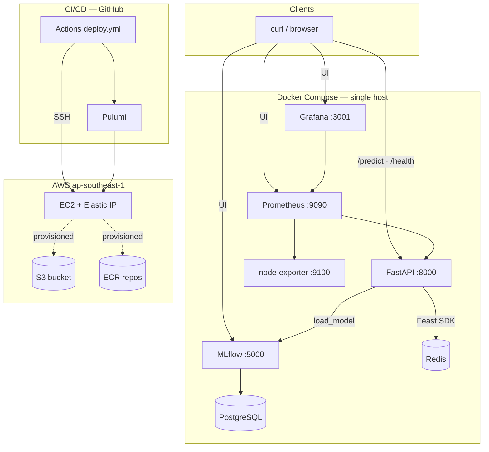
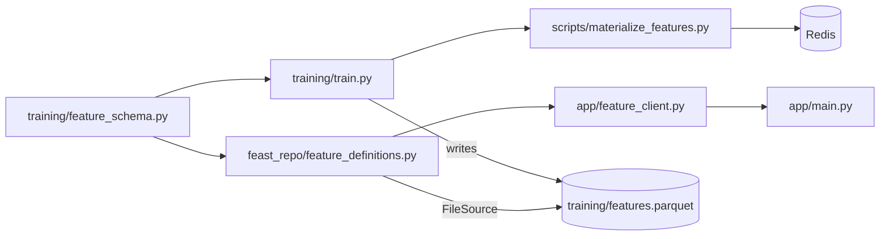
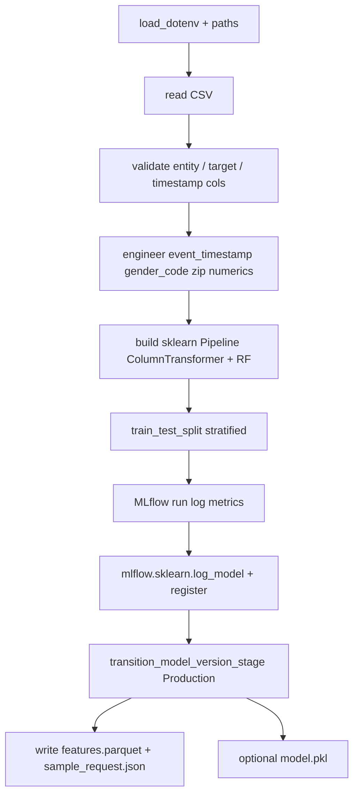
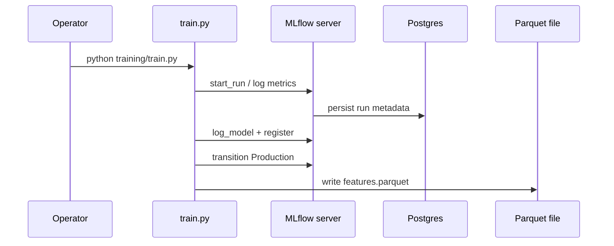
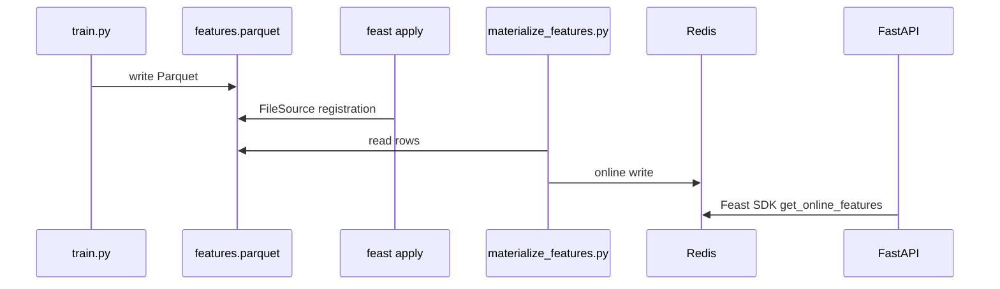
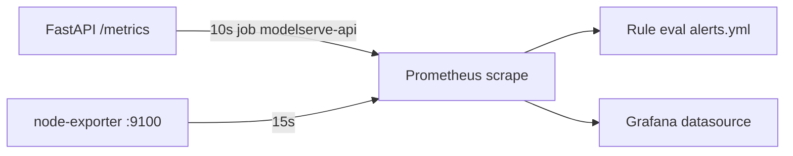
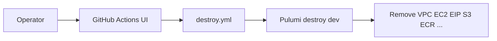
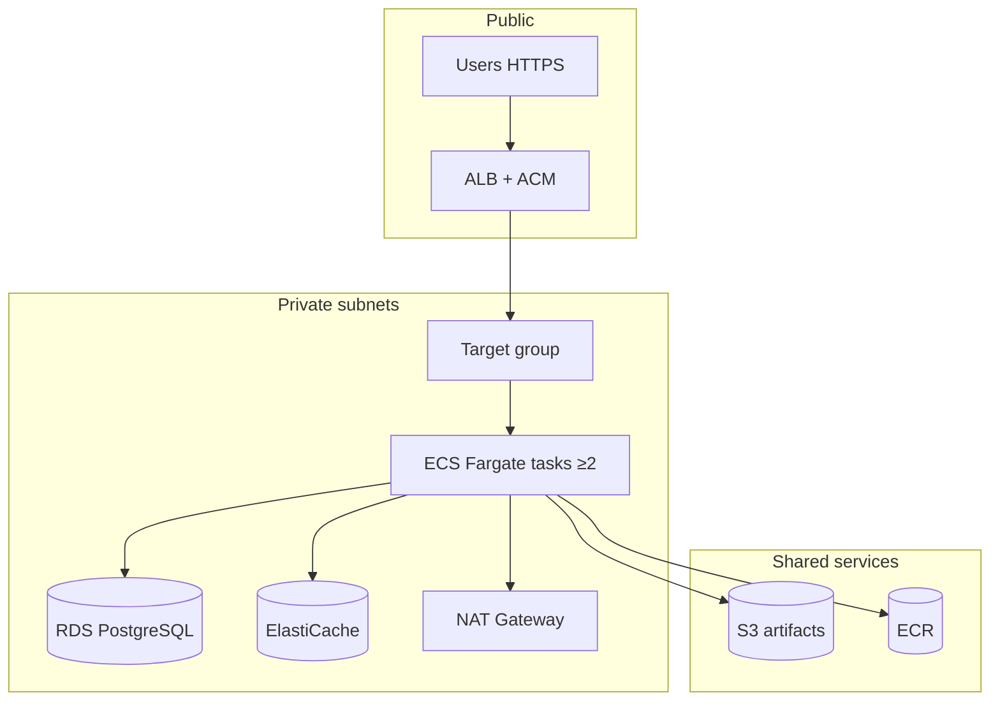
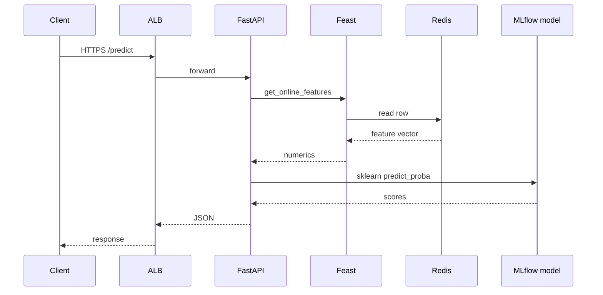
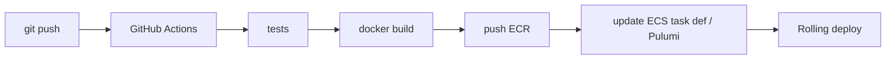

# ModelServe: From Notebook to MLOps on AWS — A Complete Technical Guide

> **Audience:** DevOps, MLOps, backend, and platform engineers; students moving toward production ML systems.  
> **Source of truth:** This repository (ModelServe capstone, Poridhi MLOps S2). All paths are relative to repo root unless stated.  
> **Disclaimer:** AWS pricing and service limits change; production numbers in §13 are **BOTEC** — validate with the [AWS Pricing Calculator](https://calculator.aws/).

---

## Table of contents

| # | Section |
|---|---------|
| 1 | [Introduction](#1-introduction) |
| 2 | [High-level architecture](#2-high-level-architecture) |
| 3 | [Project structure deep dive](#3-project-structure-deep-dive) |
| 4 | [Dataset and feature engineering](#4-dataset-and-feature-engineering) |
| 5 | [Training pipeline deep dive](#5-training-pipeline-deep-dive) |
| 6 | [MLflow deep dive](#6-mlflow-deep-dive) |
| 7 | [Feast feature store deep dive](#7-feast-feature-store-deep-dive) |
| 8 | [Serving and inference flow](#8-serving-and-inference-flow) |
| 9 | [Monitoring and observability](#9-monitoring-and-observability) |
| 10 | [Infrastructure and deployment](#10-infrastructure-and-deployment) |
| 11 | [CI/CD pipeline deep dive](#11-cicd-pipeline-deep-dive) |
| 12 | [Production readiness discussion](#12-production-readiness-discussion) |
| 13 | [BOTEC and AWS cost estimation](#13-botec-and-aws-cost-estimation) |
| 14 | [Comparative technology discussion](#14-comparative-technology-discussion) |
| 15 | [Future improvements](#15-future-improvements) |
| 16 | [Final production architecture](#16-final-production-architecture) |
| 17 | [Conclusion](#17-conclusion) |

---

## 1. Introduction

### 1.1 Project goal

**ModelServe** is an end-to-end MLOps capstone: train a **fraud classifier** on tabular transaction data, **register** the model in **MLflow**, **serve online features** through **Feast** backed by **Redis**, expose **HTTP inference** with **FastAPI**, and **observe** the system with **Prometheus** and **Grafana**. The same **Docker Compose** stack runs locally and on a single **AWS EC2** instance in **`ap-southeast-1`**, provisioned by **Pulumi** and updated from **GitHub Actions** on push to `main`.

### 1.2 Why fraud detection is a strong MLOps use case

Fraud scoring forces **real engineering concerns** early:

| Concern | Why it matters |
|---------|----------------|
| **Imbalance** | Accuracy is misleading; precision/recall and operating points matter. |
| **Train/serve alignment** | The same feature definitions must exist at training and request time. |
| **Latency** | Online inference expects sub-second paths; batch-only features are not enough without materialization. |
| **Governance** | Model versions, audit trails (MLflow runs), and observability (metrics) map to production expectations. |

### 1.3 Why production MLOps is not “notebook ML”

Notebook-centric work optimizes for **exploration**. Production MLOps optimizes for **repeatability, isolation, deployability, and failure modes**:

| Notebook ML | Production MLOps (this repo’s direction) |
|--------------|-------------------------------------------|
| Ad-hoc paths and env | **Compose**, **`.env.example`**, pinned images |
| “Works on my machine” | **CI/CD**, remote **EC2** pipeline, health checks |
| Implicit feature columns | **Feast** definitions + **shared** `feature_schema.py` |
| Pickle on disk | **MLflow** registry + **version** surfaced in API |
| Print debugging | **Prometheus** metrics + **Grafana** dashboards + **alerts** |

The capstone intentionally stops short of full HA and private networking; §12 and §16 document the **evolution path**.

---

## 2. High-level architecture

### 2.1 End-to-end Mermaid diagram (runtime + CI touchpoints)



**Note on dashed lines:** S3 and ECR exist in Pulumi (`infrastructure/__main__.py`) for continuity; the **default** runtime builds images on EC2 and stores MLflow artifacts in a **Docker volume** — see [`production-readiness.md`](production-readiness.md).

### 2.2 Component roles and interactions

| Component | Role in ModelServe | Interacts with |
|-----------|-------------------|----------------|
| **FastAPI** | HTTP API: `/health`, `/metrics`, `POST /predict` | MLflow (model), Feast client → Redis, Prometheus client library |
| **MLflow** | Tracking UI + model registry; artifact server | PostgreSQL backend store; volume for artifacts in Compose |
| **Feast** | Declarative feature definitions + SDK | `feast_repo/`, `training/features.parquet`, Redis online store |
| **Redis** | Online key-value store for Feast materialized rows | Feast materialization + `get_online_features` |
| **PostgreSQL** | MLflow metadata (runs, params, registry) | MLflow server only |
| **Prometheus** | Scrapes `/metrics` and node-exporter | Grafana datasource |
| **Grafana** | Dashboards (provisioned JSON) | Prometheus |
| **Docker Compose** | Single-host orchestration | All runtime containers |
| **Pulumi** | IaC: VPC, subnet, SG, EC2, EIP, S3, ECR | AWS API |
| **GitHub Actions** | `pulumi up` + SSH deploy pipeline | Pulumi Cloud token, AWS keys, SSH keys, Kaggle secrets |

### 2.3 Why these pieces fit together

- **Postgres + MLflow:** transactional metadata fits experiment lineage and registry transitions.
- **Redis + Feast:** low-latency entity lookups without hand-rolled Redis key strings in application code.
- **Prometheus + Grafana:** RED-style metrics for `/predict` plus host signals from node-exporter.
- **Pulumi + Actions:** declarative infra plus scripted bootstrap matches many teams’ “IaC + imperative last mile” pattern.

---

## 3. Project structure deep dive

### 3.1 Important directories

| Path | Purpose |
|------|---------|
| `app/` | FastAPI app: `main.py`, `model_loader.py`, `feature_client.py`, `metrics.py` |
| `training/` | `train.py`, `feature_schema.py`, exported `features.parquet`, `sample_request.json` |
| `feast_repo/` | `feature_definitions.py`, `feature_store.yaml` — Feast project |
| `scripts/` | `wait_for_mlflow.py`, `materialize_features.py`, `deploy_ec2.sh`, `deploy_ec2_pipeline.sh`, `bootstrap_ec2.sh` |
| `monitoring/` | Prometheus and Grafana provisioning |
| `infrastructure/` | Pulumi Python (`__main__.py`) |
| `.github/workflows/` | `deploy.yml`, `destroy.yml` |
| `docker/` | Custom **MLflow** Dockerfile (`psycopg2` for Postgres backend) |

### 3.2 Cross-package relationships



- **`feature_schema.py`** is the **contract**: entity id, timestamps, and `FEAST_NUMERIC_FEATURE_COLS` must stay aligned across `train.py`, Feast definitions, and `feature_client.py` (which duplicates the numeric list for row assembly).

### 3.3 How files reference one another (selected)

| From | To | Mechanism |
|------|-----|-----------|
| `train.py` | `feature_schema.py` | Python import |
| `feature_definitions.py` | `training/features.parquet` | `FileSource(path=...)` |
| `materialize_features.py` | Feast repo | `feast -c feast_repo` / FeatureStore API |
| `model_loader.py` | MLflow | `models:/modelserve_classifier/Production` |
| `feature_client.py` | Feast + Redis | `FeatureStore`, `get_online_features`; may patch YAML for Docker `REDIS_URL` |
| `prometheus.yml` | API | scrape target `api:8000` |

---

## 4. Dataset and feature engineering

### 4.1 Kaggle dataset

- **Dataset:** [kartik2112/fraud-detection](https://www.kaggle.com/datasets/kartik2112/fraud-detection) (not committed; large CSVs are gitignored).
- **Primary training file:** `fraudTrain.csv` → expected at `data/raw/fraudTrain.csv` (or `FRAUD_TRAIN_PATH`).
- **`fraudTest.csv`:** may exist in the Kaggle bundle for holdout evaluation; **this repo’s default training path** is **`fraudTrain.csv`** with an internal **train/test split** in `train.py`.

### 4.2 Entity and `entity_id`

| Concept | Column / field | Meaning |
|---------|----------------|---------|
| **Feast entity** | `cc_num` | Credit card number as join key (Kaggle schema). |
| **API field** | `entity_id` in JSON | Same integer as `cc_num`; stable HTTP contract name. |

### 4.3 Feature columns (Feast online slice)

Numeric features exported to Parquet and served online (from `training/feature_schema.py`):

`amt`, `lat`, `long`, `city_pop`, `merch_lat`, `merch_long`, `unix_time`, `zip`, **`gender_code`**.

### 4.4 Why `gender_code` exists

The raw Kaggle CSV includes **`gender`** as a string category. Training builds a **numeric** `gender_code` for the Feast export so the **online store schema stays numeric-only** while the **sklearn pipeline** still receives **`category`, `state`, `gender`** as categoricals from defaults at inference (see §8).

### 4.5 Preprocessing logic (conceptual)

- **Numeric branch:** imputation + scaling inside `ColumnTransformer`.
- **Categorical branch:** `OneHotEncoder` with `handle_unknown="ignore"` so **`unk`** at inference is safe.
- **Model:** `RandomForestClassifier` with `class_weight="balanced"` for imbalance.

---

## 5. Training pipeline deep dive

### 5.1 `train.py` flow (conceptual, not every line)



### 5.2 Sklearn `Pipeline` and `ColumnTransformer`

| Piece | Purpose |
|-------|---------|
| **ColumnTransformer** | Apply different preprocessing to numeric vs categorical columns. |
| **OneHotEncoder** | Sparse/binary encoding for low-cardinality categoricals; unknown levels ignored. |
| **StandardScaler** | Scale numeric columns after imputation. |
| **RandomForestClassifier** | Non-linear decision boundaries; `predict_proba` for fraud probability. |

### 5.3 Key hyperparameters (as configured in repo)

| Parameter | Typical role |
|-----------|----------------|
| `n_estimators` | More trees → smoother variance, higher train/serve cost. |
| `max_depth` | Caps tree depth → regularization vs expressiveness. |
| `min_samples_leaf` | Larger leaves → smoother, less overfit. |
| `class_weight="balanced"` | Re-weights classes inversely to frequency — critical when fraud is rare. |

### 5.4 Train/test split and metrics

- **Split:** `train_test_split(..., test_size=0.2, stratify=y, random_state=42)` — stratification preserves fraud ratio in both sets.
- **Metrics logged:** accuracy, precision, recall, F1, ROC-AUC when defined (binary confusion requires both classes in `y_test` and predictions).

### 5.5 Imbalance and `class_weight`

Fraud is typically **<1–5%** of rows. Without class weights, a model can maximize accuracy by predicting “legitimate” always. **`class_weight="balanced"`** forces the forest to pay attention to the minority class in proportion to imbalance.

### 5.6 `train.py` phases mapped to source lines

| Phase | What happens | Approx. lines (`training/train.py`) |
|-------|----------------|--------------------------------------|
| Env + paths | `load_dotenv`, `ROOT`, constants | 40–65 |
| Load CSV | `load_raw`, optional `TRAIN_MAX_ROWS` | 67–83, 92–93 |
| Column validation | Entity, target, raw timestamp | 94–97 |
| Feature engineering | `event_timestamp`, `gender_code`, numeric `zip`, coerce numerics | 99–119 |
| Label filter | Keep rows where `is_fraud` ∈ {0,1} | 121–123 |
| Column lists | `num_cols`, `cat_cols`, fillna | 125–145 |
| Feast export slice | `export` DataFrame, `cc_num` as int64 | 146–154 |
| Split | Stratified 80/20 | 160–163 |
| Pipeline | `ColumnTransformer` + `RandomForestClassifier` | 165–197 |
| MLflow run | `start_run`, `fit`, metrics, `log_model` with `registered_model_name` | 199–226 |
| Registry promotion | `transition_model_version_stage` → Production | 228–243 |
| Artifacts | `model.pkl`, Parquet, `sample_request.json` | 245–256 |



---

## 6. MLflow deep dive

### 6.1 Experiments, registry, and Production

| Concept | In this repo |
|---------|--------------|
| **Experiment** | Default `modelserve_fraud` (env override `MLFLOW_EXPERIMENT_NAME`). |
| **Registered model** | `modelserve_classifier` (`MLFLOW_MODEL_NAME`). |
| **Stage** | **Production** (`MLFLOW_MODEL_STAGE`) — API resolves `models:/…/Production`. |

### 6.2 `model.pkl` vs MLflow artifacts

- **`training/model.pkl`:** optional local pickle written by training; **not** the API’s primary source.
- **MLflow artifact:** the logged **Pipeline** object in the registry; **`model_loader.py`** loads via `mlflow.sklearn.load_model`.

### 6.3 Metadata vs artifacts

| Store | Holds |
|-------|--------|
| **PostgreSQL** (MLflow backend) | Run metadata, params, metrics, registry version records. |
| **Artifact store** | Model binaries, conda/env metadata — here served from MLflow container path with `--serve-artifacts` and a **Docker volume** in Compose so host-side `train.py` uploads over HTTP instead of broken `file:` paths. |

### 6.4 Docker Compose MLflow service (artifacts + backend)

The MLflow container uses a **custom image** (`docker/mlflow/Dockerfile`) for **`psycopg2`** support with `--backend-store-uri postgresql://…`. Artifacts use **`--serve-artifacts`** and **`--artifacts-destination /mlflow/artifacts`** with a named volume so **host-side** `train.py` can upload without broken `file:` paths (see comments in `docker-compose.yml`). **`MLFLOW_S3_IGNORE_TLS`** is set in Compose for dev convenience — **remove for real production** when using strict TLS to S3.

### 6.5 How the API loads Production

```12:41:app/model_loader.py
MLFLOW_TRACKING_URI = os.environ.get("MLFLOW_TRACKING_URI", "http://127.0.0.1:5000")
MLFLOW_MODEL_NAME = os.environ.get("MLFLOW_MODEL_NAME", "modelserve_classifier")
MLFLOW_MODEL_STAGE = os.environ.get("MLFLOW_MODEL_STAGE", "Production")
// ...
        uri = f"models:/{MLFLOW_MODEL_NAME}/{MLFLOW_MODEL_STAGE}"
        _model = mlflow.sklearn.load_model(uri)
        client = MlflowClient(tracking_uri=MLFLOW_TRACKING_URI)
        versions = client.get_latest_versions(MLFLOW_MODEL_NAME, stages=[MLFLOW_MODEL_STAGE])
```

**Startup only:** the model is loaded once in FastAPI **lifespan** — changing Production in MLflow requires **API restart** to pick up a new artifact.

---

## 7. Feast feature store deep dive

### 7.1 Offline vs online

| Plane | What | In ModelServe |
|-------|------|----------------|
| **Offline** | Batch/historical features | `FileSource` → `training/features.parquet` (`offline_store: file` in `feature_store.yaml`). |
| **Online** | Low-latency serving | **Redis**; populated by `scripts/materialize_features.py` after `feast apply`. |

### 7.2 Entity, FeatureView, `feature_definitions.py`

- **Entity:** `cc_num` with `join_keys=[cc_num]`.
- **FeatureView:** `fraud_txn_features`, `online=True`, TTL long-lived, schema = numeric fields only.

### 7.3 `feature_store.yaml`

- **`registry`:** local `data/registry.db` (created by Feast CLI).
- **`online_store`:** Redis with `connection_string` in **`host:port,db=0`** form (required for this Feast + redis-py combo per repo comments).
- **Docker note:** `feature_client.py` may copy `feast_repo` to temp and patch Redis host from `REDIS_URL` so the API container talks to the `redis` service.

### 7.4 Materialization and `get_online_features`

- **`feast -c feast_repo apply`** registers definitions.
- **`materialize_features.py`** loads keys from the Parquet export into Redis.
- **No Feast server container:** Feast is **library + CLI**; Redis is the only long-running “feature infra” process.



---

## 8. Serving and inference flow

### 8.1 FastAPI lifespan and startup

```36:48:app/main.py
@asynccontextmanager
async def lifespan(app: FastAPI):
    global _feast_client, _feast_init_error
    model_loader.load_from_registry()
    if model_loader.is_ready():
        metrics.set_served_model(MLFLOW_MODEL_NAME, model_loader.version_string() or "unknown")
    _feast_client = None
    _feast_init_error = None
    try:
        _feast_client = FeastFeatureClient()
    except Exception as exc:  # noqa: BLE001
        _feast_init_error = str(exc)
        logger.exception("Feast FeatureStore init failed: %s", exc)
    yield
```

**Order matters:** MLflow model first, then Feast. If Feast fails, `/health` can still return `healthy` with a **degraded Feast** note — see `health()`.

### 8.2 Prediction path


### 8.3 Error handling and HTTP semantics

| Condition | HTTP | `error.code` (when JSON error body) |
|-----------|------|--------------------------------------|
| Model not loaded | 503 | `model_unavailable` |
| Feast client failed init | 503 | `feast_unavailable` |
| Unknown / missing entity features | 404 | `missing_features` |
| Inference failure | 500 | `inference_error` |
| Unexpected | 500 | `internal_error` |

### 8.4 Prometheus metrics (inference)

From `app/metrics.py`: `prediction_requests_total`, `prediction_duration_seconds` (histogram), `prediction_errors_total{reason}`, Feast hit/miss counters, `model_version_info` gauge.

---

## 9. Monitoring and observability

### 9.1 Prometheus scrape model

- **Global scrape:** 15s; **API job** overrides to **10s** for fresher RED metrics (`monitoring/prometheus/prometheus.yml`).
- **Targets:** `api:8000`, `node-exporter:9100`, self.

### 9.2 Grafana

- Datasource and **ModelServe — Overview** dashboard are **file-provisioned** under `monitoring/grafana/provisioning/`.

### 9.3 Alert rules (excerpt)

```8:27:monitoring/prometheus/alerts.yml
      - alert: ModelServeHighPredictionLatencyP95
        expr: histogram_quantile(0.95, sum by (le) (rate(prediction_duration_seconds_bucket{job="modelserve-api"}[5m]))) > 2
        for: 5m
      - alert: ModelServeHighPredictionErrorRate
        expr: (sum(rate(prediction_errors_total{job="modelserve-api"}[5m])) / clamp_min(sum(rate(prediction_requests_total{job="modelserve-api"}[5m])), 1e-9)) > 0.1
        for: 5m
      - alert: ModelServeAPIDown
        expr: up{job="modelserve-api"} == 0
        for: 1m
```

### 9.4 Why monitoring matters for ML systems

- **Latency + errors** catch dependency regressions (Redis, MLflow) before users open tickets.
- **Model version gauge** ties dashboards to **which artifact** is live — critical when multiple versions exist in Staging vs Production.

### 9.5 Monitoring data path (Mermaid)



---

## 10. Infrastructure and deployment

### 10.1 Pulumi architecture (summary)

`infrastructure/__main__.py` defines: **VPC**, **IGW**, **single public subnet** (`ap-southeast-1a`), **security group** (SSH + app ports), **EC2** `t3.medium`, **Elastic IP**, **S3 bucket**, **ECR repositories**, **KeyPair** from config `sshPublicKey`.

### 10.2 EC2 bootstrap (two layers)

| Layer | What runs |
|-------|-----------|
| **User-data** (Pulumi `USER_DATA`) | `apt-get`, Docker CE, compose plugin, `ubuntu` in docker group — see `infrastructure/__main__.py`. |
| **`scripts/bootstrap_ec2.sh`** | Optional **verification** script (Docker, compose, aws, git, unzip) — not the same as full app deploy. |

### 10.3 `deploy_ec2.sh` runtime order (high level)

1. Clone/pull repo  
2. `.env` from `.env.example` if missing; inject public URLs for MLflow/Grafana  
3. venv + `pip install -r requirements.txt`  
4. `docker compose up -d postgres redis mlflow`  
5. `wait_for_mlflow.py`  
6. `training/train.py` if `data/raw/fraudTrain.csv` exists  
7. Require `training/features.parquet`  
8. `feast -c feast_repo apply`  
9. `materialize_features.py`  
10. `docker compose up -d --build`  
11. Poll `/health` on localhost  

**Why ordering matters:** MLflow must accept runs before training; Parquet must exist before Feast materialize; Redis must contain keys before meaningful `/predict` for exported entities.

### 10.4 `wait_for_mlflow.py`

Blocks until the tracking server responds — prevents racing `train.py` against a still-starting MLflow container.

---

## 11. CI/CD pipeline deep dive

**Concurrency:** `deploy.yml` uses `concurrency: group: deploy-main` with `cancel-in-progress: false` so overlapping pushes to `main` serialize instead of corrupting Pulumi state.

### 11.1 GitHub Actions (`deploy.yml`)


### 11.2 Secrets (mandatory subset)

Documented in `docs/github-secrets.md`: AWS keys + region, Pulumi token, SSH public/private pair, Kaggle username/key; optional `PULUMI_CONFIG_PASSPHRASE`.

### 11.3 Kaggle on EC2

`deploy_ec2_pipeline.sh` writes `~/.kaggle/kaggle.json` from secrets, downloads the dataset, caps rows with `TRAIN_MAX_ROWS=50000` for CI-friendly training, then **`exec`s** `deploy_ec2.sh`.

### 11.4 Destroy workflow

`destroy.yml` is **`workflow_dispatch`** — manual teardown from the Actions UI; it mirrors the deploy job’s AWS + Pulumi bootstrap then runs **`pulumi destroy --yes`** on stack **`dev`**. On partial failures, logs may suggest **`pulumi state delete 'urn:…'`** for stuck resources — run locally with care, then re-run destroy (see `docs/final-runbook.md`).



### 11.5 IAM / Pulumi troubleshooting (conceptual)

Orphaned AWS resources vs Pulumi state can cause **`EntityAlreadyExists`** — align state with reality (import or delete orphans) per runbook; not unique to this repo.

---

## 12. Production readiness discussion

### 12.1 Current limitations (single EC2)

- **SPOF:** one AZ, one instance, one Compose host.  
- **Security:** wide SG ingress for lab; HTTP services.  
- **Durability:** MLflow artifacts on Docker volume unless migrated to S3.  
- **ECR/S3:** provisioned; default pipeline **builds locally on EC2** — document honestly.

### 12.2 Production patterns (checklist)

| Topic | Direction |
|-------|-----------|
| **HA** | Multi-AZ, ≥2 API tasks, external RDS/ElastiCache |
| **Scaling** | Horizontal pods/tasks + ALB |
| **Security** | Private subnets, TLS at ALB, SSM over SSH, least-privilege IAM |
| **DR** | Backups, S3 versioning, RPO/RTO targets |
| **Blue/green / canary / A/B** | Two target groups or traffic weights; registry aliases or routing keys |

**TODO:** Implement chosen HA pattern in IaC before claiming production readiness.

---

## 13. BOTEC and AWS cost estimation

### 13.1 Purpose

**Back-of-the-envelope** monthly cost for a **target** stack (Fargate + ALB + NAT + RDS Multi-AZ + ElastiCache + S3 + ECR + CloudWatch), **`ap-southeast-1`**, on-demand list prices — **verify** in the [AWS Pricing Calculator](https://calculator.aws/).

### 13.2 Rough monthly table (from `production-readiness.md`)

| Component | Assumption | Approx / month |
|-----------|------------|----------------|
| ECS Fargate API | 2× (0.5 vCPU, 1 GiB), 730 h | **$40–50** |
| RDS PostgreSQL | `db.t3.medium` Multi-AZ + 100 GiB | **$110–130** |
| ElastiCache | 1× `cache.t3.micro` | **$15–25** |
| ALB | 1 ALB, low traffic | **$22–30** |
| NAT Gateway | 2 NATs + 50 GiB processed | **$68–80** |
| S3 | 200 GiB | **$5–8** |
| ECR | ~10 GiB | **~$1** |
| CloudWatch | logs + alarms | **$5–15** |
| Contingency | 10–20% | **$30–60** |

**Rough total:** **$300–400/month** — planning anchor **~$350/month**.  
**Cheaper dev:** Single-AZ RDS + 1 NAT + smaller cache + stop when idle → **~$150–220/month**.

**TODO:** Re-run calculator when region, traffic, or HA choices change.

---

## 14. Comparative technology discussion

| Choice | Rationale in this capstone | Alternatives |
|--------|-------------------------|--------------|
| **RandomForest** | Strong sklearn baseline, `predict_proba`, `class_weight`, fits course scope | **XGBoost / LightGBM / CatBoost** for tabular SOTA; **NNs** when data/volume justify |
| **Feast** | Schema + train/serve alignment without raw Redis in `main.py` | Custom Redis keys (error-prone), proprietary feature platforms |
| **MLflow** | Open registry + tracking integrated with sklearn | **SageMaker Model Registry** when all-in on AWS training/deploy |
| **FastAPI** | Async-friendly, OpenAPI, fast iteration | Flask, gRPC |
| **Pulumi** | Python IaC matches repo language | Terraform HCL, CDK |
| **Redis** | Feast-documented online pattern | KeyDB, managed Redis later |
| **Prometheus/Grafana** | Pull metrics, dashboards-as-code | CloudWatch-only, Datadog |

---

## 15. Future improvements

| Area | Idea |
|------|------|
| **Drift** | Batch jobs + Evidently / statistical tests on Parquet slices |
| **Retraining** | Scheduled pipeline (Airflow / Step Functions) |
| **Orchestration** | Airflow for DAGs across extract → train → register → materialize |
| **Streaming** | Kafka / Pulsar + stream features + shorter materialization windows |
| **Feature monitoring** | Feast + metrics on null rates / schema violations |
| **Distributed training** | Spark / Ray / Horovod for scale |
| **GPU inference** | Triton, SageMaker endpoints |
| **Vector DB** | If moving to embeddings-based fraud or hybrid search |
| **Online learning** | Rare in regulated fraud; usually periodic retrain |
| **Lineage** | OpenLineage, data catalog integration |
| **Data quality** | Great Expectations / dbt tests on training inputs |

---

## 16. Final production architecture

### 16.1 Enterprise-style AWS diagram (target)



### 16.2 Request flow (HTTPS)



### 16.3 CI/CD flow (target)



---

## 17. Conclusion

ModelServe compresses a **credible MLOps slice** into one repository: **training and registry** (MLflow), **feature consistency** (Feast + Redis), **serving** (FastAPI), **observability** (Prometheus/Grafana), and **delivery** (Pulumi + Actions + EC2). The gap between this stack and **production** is mainly **durability, HA, networking, and cost discipline** — articulated in [`production-readiness.md`](production-readiness.md) and §12–§16 here.

**Lessons learned:** treat **`feature_schema.py`** as a contract; load models **once** with explicit registry stages; prefer **structured errors** over silent defaults in fraud; instrument **latency and errors** from day one.

**Mindset shift:** DevOps optimizes **deployable units**; MLOps also optimizes **data and model lineage**, **train/serve parity**, and **operating points** under imbalance. Feature stores and model registries exist so teams can answer **what ran** and **with which features** months after a release.

---

*End of guide. For operations commands, see [`final-runbook.md`](final-runbook.md); for graded architecture template, see [`ARCHITECTURE.md`](ARCHITECTURE.md).*
