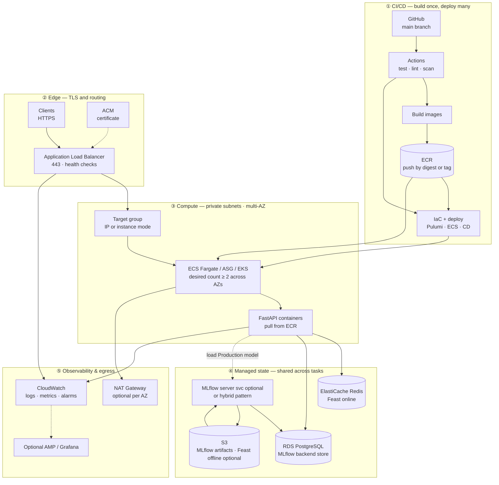

# Production readiness: gaps, evaluation, and migration

This document describes **design limitations** of the current ModelServe capstone stack, **how to identify and judge them**, and a **step-by-step path** toward a production-grade deployment—including **high availability (HA)**, **TLS**, an **Application Load Balancer (ALB)**, **removing single-EC2 dependency**, and honest use of **ECR** and **S3**. It adds a **target production flow diagram** (§4.1), maps required changes across **application code**, **infrastructure**, and **monitoring**, and ends with a step-by-step **BOTEC** for **rough AWS monthly cost** (§12).

---

## 1. Honest baseline: what runs today

The stack is intentionally **single-host** and **demo-oriented**:

| Concern | Current behavior |
|--------|-------------------|
| **Compute** | One EC2 instance (`infrastructure/__main__.py`) with Docker Compose. |
| **Deploy** | GitHub Actions runs `pulumi up`, then SSH runs `scripts/deploy_ec2_pipeline.sh` → `scripts/deploy_ec2.sh`, which **`docker compose up -d --build`**—images are **built on the instance**, not pulled from ECR. |
| **MLflow artifacts** | Stored in a **Docker volume** (`mlflow_artifacts`) with `--serve-artifacts` and `--artifacts-destination /mlflow/artifacts` in `docker-compose.yml`. |
| **ECR** | **Provisioned** in Pulumi (`modelserve-api`, `modelserve-mlflow`) and **`ml_inference_repo_url` is exported**, but the runtime **does not pull or push** images to these repositories in the default pipeline. |
| **S3** | **Provisioned** (`modelserve-{stack}-{account}-artifacts`), but **MLflow does not use it** as `default-artifact-root`; artifacts stay on local volume. |
| **Feast** | `feast_repo/feature_store.yaml` uses **file** offline store and **Redis** online store—not S3. |

**Documentation rule:** Do **not** claim that ECR or S3 are **actively used** for artifacts or image delivery unless I have wired them in code, Compose, IAM, and CI. It is accurate to say: *ECR and S3 are provisioned for AWS alignment and future production hardening; the current runtime builds images locally on EC2 and stores MLflow artifacts in a Docker volume.*

---

## 2. Design problems (catalog) and how to identify them

Use this as a checklist when reviewing the repo or demo architecture.

### 2.1 Single point of failure (SPOF)

- **Symptom:** One EC2, one AZ (`ap-southeast-1a` only), one Elastic IP, Compose on one host.
- **How to verify:** `infrastructure/__main__.py` — single subnet, single instance, no Auto Scaling Group (ASG), no multi-AZ.
- **Risk:** Instance loss or AZ outage stops API, MLflow UI, Redis, and Postgres together.

### 2.2 Stateful data on ephemeral-friendly paths

- **Symptom:** MLflow binaries live on a **volume on the instance**; Postgres and Redis are **containerized on the same host** with Compose volumes.
- **How to verify:** `docker-compose.yml` — `mlflow_artifacts` volume; Postgres/Redis not replaced by RDS/ElastiCache in infra.
- **Risk:** Disk corruption, termination without backup, or replacement VM loses artifacts and registry-backed experiments unless I restore backups.

### 2.3 Security group and transport

- **Symptom:** Ingress from `0.0.0.0/0` on **22, 8000, 3001, 5000, 9090** (`__main__.py`). HTTP only at the edge (no TLS in front of services).
- **How to verify:** Pulumi security group rules; URLs in `deploy_ec2.sh` use `http://`.
- **Risk:** Broad attack surface; credentials and model endpoints exposed on plaintext HTTP if reachable from the internet.

### 2.4 ECR and S3 “provisioned but unused”

- **Symptom:** **ECR** repos exist but CI/build path uses **`docker compose --build`** on EC2. **S3** bucket exists but MLflow uses **local volume** artifact destination.
- **How to verify:** Grep for `ecr`, `docker login`, `artifacts-destination`, `s3://`, `MLFLOW_S3`; compare `deploy_ec2.sh` / `deploy.yml` to Pulumi exports.
- **Risk:** **Operational**, not “wrong” for a capstone: I cannot replace the VM by pulling a pinned image from ECR or restore models from S3 without extra work.

### 2.5 No managed load balancer or health-based routing

- **Symptom:** Clients hit **instance IP:port** directly; no ALB, no target group health checks at the AWS edge.
- **How to verify:** No `aws.lb` resources in Pulumi; docs reference direct ports.
- **Risk:** No graceful draining, no multi-instance routing, harder TLS termination at scale.

### 2.6 Monitoring gaps for production

- **Symptom:** Prometheus scrapes **Compose service names** (`api:8000`)—fine on one host; **static config** only (`monitoring/prometheus/prometheus.yml`).
- **How to verify:** No service discovery for ECS/Kubernetes, no remote-write to AMP, no centralized log shipping in infra.
- **Risk:** Dashboards break or need redesign when I move to multiple tasks/instances; logs remain on one machine unless shipped.

### 2.7 Feast offline store on local file

- **Symptom:** `offline_store: type: file` in `feast_repo/feature_store.yaml`.
- **How to verify:** Read Feast config; training writes Parquet under repo-managed paths.
- **Risk:** Large teams or multi-node training need **durable, shared** offline storage (often **S3** + compatible offline store config).

---

## 3. How to evaluate severity (simple rubric)

For each finding, score:

| Dimension | Question |
|----------|----------|
| **Availability** | Does failure of one component stop all revenue paths or only degrade? |
| **Durability** | Can I restore RPO/RTO targets from backups? |
| **Security** | Is data encrypted in transit and at rest? Who can reach admin ports? |
| **Operability** | Can I roll back a bad deploy in minutes? Pin image digests? |
| **Cost/complexity** | Does the fix justify ops overhead for this workload size? |

Document the **target** (e.g., “99.9% API monthly” vs “best-effort demo”) before choosing AWS services.

---

## 4. Migration roadmap (high level)

Order matters: **durability and secrets** before **horizontal scale**, **TLS** before **public multi-instance** exposure.

1. **Externalize durable state:** RDS for Postgres, ElastiCache for Redis (or keep Redis on ASG with replication—often ElastiCache is simpler), **S3 for MLflow artifacts**.
2. **Immutable artifacts:** Build in CI, **push to ECR**, deploy by **image tag** (no `git pull` + `docker build` on prod for critical path—or restrict build to staging only).
3. **Network & TLS:** Private subnets for workloads; **ALB** in public subnets with **ACM certificate**; restrict SG to ALB and bastion/VPN only.
4. **HA compute:** **ECS Fargate** or **EKS**, or **ASG + user-data** pulling from ECR (last option still needs LB + state externalization); minimum **2 tasks/instances** across **2+ AZs**.
5. **Observability:** CloudWatch/container insights or Prometheus operator; ALB access logs; centralize logs (e.g., CloudWatch Logs / OpenSearch).

The sections below break this into **code**, **infra**, and **monitoring** steps.

### 4.1 Target production flow (end-to-end diagram)

This is the **same narrative style** as the capstone runtime diagram in [`ARCHITECTURE.md`](ARCHITECTURE.md) §2.3, but for the **intended production shape**: **immutable images**, **managed data**, **TLS at the load balancer**, and **no single EC2** for the serving path. Read **top → bottom**.

**How this differs from today:** **No** `docker compose --build` on the prod host for the API path; **no** Postgres/Redis **only** on local volumes for prod; **users never** hit instance IP:port—only **ALB:443**. **ECR + RDS + ElastiCache + S3** are on the **hot path**; costs scale with **tasks, DB size, cache nodes, and NAT/ALB LCUs**—see **§12 BOTEC**.

---

## 5. ECR: moving from “provisioned” to “used”

### Current state

- Pulumi creates `modelserve-api` and `modelserve-mlflow` ECR repositories.
- EC2 runs `docker compose up -d --build` (`scripts/deploy_ec2.sh`), producing **local tags** like `modelserve-api:local`.

### Production target

- CI builds images once, scans (optional), pushes **`${ACCOUNT}.dkr.ecr.${REGION}.amazonaws.com/modelserve-api:${GIT_SHA}`** (and same for MLflow if custom image remains).
- Runtime **pulls** by digest or immutable tag; **no compiler/toolchain** required on prod EC2/ECS for the serving image.

### Step-by-step changes

**Infrastructure**

1. Add IAM role for EC2 (instance profile) or ECS task role with **`ecr:GetAuthorizationToken`** and **`ecr:BatchGetImage`** (and push permissions for CI role only).
2. Enable **ECR image scanning** and lifecycle policies (retain last N images).
3. Replace or complement `force_delete=True` with policies appropriate for prod (often **retain** images).

**CI / GitHub Actions (`deploy.yml`)**

1. After tests, **build** API (and MLflow if needed) images.
2. **`aws ecr get-login-password`** → **`docker push`** to both repos with **`GITHUB_SHA`** tag.
3. Pass **image URI** to deploy step (SSM Parameter Store, S3 env file, or Pulumi stack config)—avoid baking secrets into tags.

**Code / Compose**

1. Change `docker-compose.yml` from `build:` + `image: modelserve-api:local` to **`image: ${API_IMAGE_URI}`** with no `build` in production compose file (keep a `docker-compose.dev.yml` override for local builds).
2. On EC2 or ECS, **`docker compose pull`** then **`up -d`** (or ECS task definition uses same URI).

**Operational**

1. Document **rollback**: redeploy previous image tag.
2. Optionally use **image digest** in prod task definitions for strongest immutability.

---

## 6. S3: moving MLflow (and optionally Feast) to durable object storage

### Current state

- Pulumi creates **`s3_bucket_name`** export.
- MLflow uses **`--artifacts-destination /mlflow/artifacts`** with a **volume**, not `s3://...`.

### Production target

- MLflow **`default-artifact-root`** (and optionally backend if I stay self-hosted) points at **`s3://bucket/prefix`**, with **SSE-SSE** or **KMS** and **IAM role** credentials (no long-lived keys on disk).
- Training clients (`MLFLOW_TRACKING_URI`) still talk to the tracking server; **artifact upload/download** uses S3 after server is configured.

### Step-by-step changes

**Infrastructure**

1. **Bucket policy** + **block public access**; enable **versioning** for artifact recovery; consider **lifecycle** for old runs.
2. IAM policy: **`s3:PutObject`, `GetObject`, `ListBucket`** on the artifact prefix for the runtime role (EC2 instance profile or ECS task role).
3. **VPC endpoint for S3** (optional) to keep artifact traffic off the public internet from private subnets.

**Application / MLflow configuration**

1. Set MLflow server command to use **`--default-artifact-root s3://...`** (and remove or narrow local `--artifacts-destination` depending on MLflow version and whether I still **serve** artifacts through the server—many prod setups use **direct S3** from clients with proper IAM).
2. Ensure **`MLFLOW_S3_IGNORE_TLS`** is **not** set to ignore TLS in prod (currently present in `docker-compose.yml` for dev convenience—remove for production).
3. Provide AWS credentials via **instance/task role**; avoid static keys in `.env` on servers.

**Training / CI**

1. `training/train.py` and any host-side scripts must use a tracking URI and credentials that can **write** to the same bucket/prefix.
2. After migration, **backfill** or accept that **old runs** remain only in the old volume unless migrated.

**Feast (optional extension)**

1. Change **`offline_store`** from **file** to **S3**-backed configuration per Feast docs; coordinate with training Parquet layout.
2. Redis online store can remain ElastiCache with connection string from secrets.

---

## 7. High availability (HA) and removing single-EC2 dependency

### What “remove single EC2 dependency” means

- **No irreplaceable state** on the instance (see §6).
- **At least two** running copies of **stateless** services (API) across **AZs**, behind an **ALB**.
- **Managed databases** (RDS Multi-AZ, ElastiCache with replicas) or equivalent.

### Infrastructure sequence

1. **VPC:** At least **two public subnets** (ALB) + **two private subnets** (tasks/instances); NAT Gateway(s) for outbound if private.
2. **RDS Postgres:** Migrate MLflow **backend store** from container Postgres to RDS; update MLflow `--backend-store-uri`.
3. **ElastiCache Redis:** Point Feast online store to cluster endpoint; update `feature_store.yaml` / env-driven config for prod.
4. **Compute:** Prefer **ECS Fargate service** (desired count ≥ 2) or **EKS**; minimal path is **ASG across AZs** + pull-from-ECR, still need ALB + external state.
5. **ALB:** HTTP/HTTPS listener on **443** (ACM cert); target group health check on **`/health`**; idle timeout aligned with API.

### Application code

1. **Health checks:** Keep **`/health`** fast (no blocking ML loads); use **`/ready`** if I split liveness/readiness.
2. **Sessions / cookies:** API should be **stateless** so any instance can serve (already typical for FastAPI + MLflow client loading model once at startup—ensure **thread-safe** inference if scale-out).
3. **Feast:** Online features must hit **shared Redis** (ElastiCache), not localhost-only binding.

### Deployment flow change

- Replace “SSH + `deploy_ec2.sh`” with **ECS rolling update**, **CodeDeploy**, or **GitHub Actions → ECS deploy** / **`pulumi up` updating task definitions**—SSH becomes emergency-only (SSM Session Manager preferred over open port 22).

---

## 8. TLS security

| Layer | Current | Production direction |
|-------|---------|------------------------|
| **Edge** | Direct HTTP to ports | **ALB + ACM** certificate; optional **WAF** |
| **Service mesh / internal** | HTTP inside Compose network | mTLS optional (App Mesh / Istio) or at minimum TLS to RDS/ElastiCache where supported |
| **MLflow / Grafana** | Exposed HTTP | Put behind **ALB path rules**, **VPN**, **SSO**, or **private only** + **SSM port forward** |

**Code/config**

- Use **`https://`** in **`MLFLOW_PUBLIC_URI`**, **`GF_SERVER_ROOT_URL`**, and any browser-facing docs once ALB terminates TLS.
- Set Grafana **`GF_SERVER_ROOT_URL`** to the public HTTPS URL to avoid broken links and cookie issues.

---

## 9. ALB: concrete wiring

1. Create **ALB** spanning **≥ 2 AZs**.
2. Create **target group** (IP or instance type matching ECS/EC2 choice); health check **`/health`**, proper matcher **200**.
3. **Listener 443** → forward to target group; optional **HTTP → HTTPS redirect** on port 80.
4. **Security groups:** ALB allows **443** from internet or corporate CIDR; **tasks/instances** allow **traffic only from ALB SG** on app port (not `0.0.0.0/0`).
5. **Pulumi / IaC:** Add `aws.lb.LoadBalancer`, `Listener`, `TargetGroup`, `ListenerCertificate` (ACM ARN).

---

## 10. Monitoring and operations for production

| Area | Current | Change |
|------|---------|--------|
| **Metrics** | Prometheus scrapes static Compose names | For ECS: **sidecar** or **AMP** + **ADOT**; scrape via service discovery or CloudWatch metrics |
| **Logs** | Container stdout on host | **awslogs** driver or **Fluent Bit** → CloudWatch; correlate **trace/request ID** |
| **Alerts** | `monitoring/prometheus/alerts.yml` local | Port rules to **Alertmanager** / **Amazon Managed Prometheus** / **CloudWatch alarms** (ALB 5xx, target unhealthy, RDS CPU) |
| **Dashboards** | Grafana in Compose | Managed Grafana or **import dashboards** with datasources pointing to new Prometheus |
| **Uptime** | Manual curl | **Route 53 health checks** or synthetic canaries |

**Code**

- Keep **`/metrics`** stable for Prometheus; document histogram buckets if I change SLIs.
- Avoid logging **PII**; ensure **structured logs** for search.

---

## 11. Consolidated checklist (code vs infra vs monitoring)

### Application / repository

- [ ] Split **prod Compose** (image-only, env from secrets) vs **dev Compose** (build local).
- [ ] MLflow: **S3 artifact root**; remove dev-only TLS skip flags for AWS.
- [ ] Feast: prod **`feature_store`** override (ElastiCache + optional S3 offline).
- [ ] Health/readiness endpoints suitable for **ALB** and orchestrators.
- [ ] Config via **environment / SSM**, not only `.env` copied on disk.

### Infrastructure (Pulumi / AWS)

- [ ] **Multi-AZ** VPC layout; private subnets for workloads.
- [ ] **RDS** + **ElastiCache** (or justified alternatives).
- [ ] **S3** bucket policies, encryption, versioning.
- [ ] **ECR** push/pull IAM; lifecycle and scanning.
- [ ] **ALB + ACM**; lock down **security groups** (remove open SSH/app from world where possible).
- [ ] **ECS/EKS/ASG**—no single instance for API tier.
- [ ] **IAM roles** instead of static AWS keys on EC2.

### Monitoring

- [ ] Central logs and **retry/dlq** visibility for async paths (if added).
- [ ] **ALB + RDS + ECS** alarms; on-call runbook updates (`docs/final-runbook.md` successor).

---

## 12. AWS infrastructure BOTEC (back-of-the-envelope monthly cost)

**BOTEC** = *back-of-the-envelope calculation*: a **repeatable** rough monthly estimate before opening the [**AWS Pricing Calculator**](https://calculator.aws/) or the official **per-service pricing pages**. Numbers move with region, purchase options (Savings Plans), and AWS price changes—**always reconcile** before budgeting.

**Region assumed:** `ap-southeast-1` (Singapore), matching this repo’s Pulumi default. Currency **USD**/month unless noted.

### Step 1 — List what bills every month

Write down every **paid component** in the target architecture (from §4.1 diagram):

| # | Component | Bills mainly by… |
|---|-----------|------------------|
| 1 | **VPC** | Usually no charge for VPC/subnets; **NAT Gateway**, **VPC endpoints**, **public IPs** cost money. |
| 2 | **NAT Gateway** | **Hourly** per NAT + **GB processed** (often the surprise line item). |
| 3 | **Application Load Balancer** | **Hourly** per ALB + **LCU usage** (connections, new flows, rules, bytes). |
| 4 | **ACM** | Public certs on AWS **free**; **private CA** costs extra (usually skip for BOTEC). |
| 5 | **ECS Fargate** (or EC2 for tasks) | **vCPU-hours** + **GB-hours** per task × **task count** × **hours running**. |
| 6 | **ECR** | **Storage** GiB-month for images + **data transfer** out to internet (often small if stays in-region). |
| 7 | **RDS PostgreSQL** | **Instance hours** (class × Single vs Multi-AZ) + **storage GiB-month** + **IOPS** (gp3/io2) + **backup** beyond free tier. |
| 8 | **ElastiCache Redis** | **Node hours** × node count × instance type + optional **replicas**. |
| 9 | **S3** | **Storage** class + **requests** (PUT/GET) + **lifecycle** transitions. |
| 10 | **CloudWatch** | **Logs ingestion** GB + **stored** GB + **custom metrics** + **alarms** (first alarms often cheap). |
| 11 | **Data transfer** | **Cross-AZ**, **out to internet**, **NAT** processing—add **10–20% contingency** if unsure. |

Skip components I **do not** deploy (e.g. no NAT if using **IPv6 egress-only** or **VPC endpoints** only—rare for first BOTEC).

### Step 2 — Fix “always-on” vs “elastic” assumptions

1. **Running hours per month:** use **730** h/month for 24/7 (`24 × 365 / 12 ≈ 730`).
2. **API tier:** pick **desired task count** (e.g. **2** for HA) and **size** (e.g. **0.5 vCPU, 1 GiB** per task).
3. **RDS:** pick **instance class** (e.g. `db.t3.medium`) and **Multi-AZ** vs **Single-AZ** (Multi-AZ roughly **doubles** instance cost vs single-instance standby pricing model—verify in calculator).
4. **ElastiCache:** pick **node type** and **# nodes** (primary + replica for HA).
5. **NAT:** **one NAT per AZ** for symmetric HA outbound vs **one NAT** for cost cap (trade availability).

### Step 3 — Pull unit prices (one-time lookup)

For each row in Step 1, open the official **pricing page** for **ap-southeast-1** and note:

- **$/hour** (ALB, NAT, RDS instance, ElastiCache node, Fargate vCPU and GB).
- **$/GB-month** (EBS if EC2, RDS storage, S3 Standard, ECR storage).
- **$/LCU-hour** or ALB **processed bytes** rules (use calculator for LCUs if unsure).

Bookmark the [**Pricing Calculator**](https://calculator.aws/) and export a CSV when the architecture stabilizes.

### Step 4 — Compute each line (template)

Fill **Quantity × unit rate × time**; example formulas:

| Line item | Formula sketch |
|-----------|----------------|
| **Fargate (Linux)** | `(vCPU_rate × vCPU × task_count × 730) + (mem_rate × GiB × task_count × 730)` — use **Fargate pricing** for region/OS. |
| **RDS instance** | `instance_hourly × 730` × **(2 if Multi-AZ pricing model says so)** — calculator handles Multi-AZ explicitly. |
| **RDS storage** | `gp3_price_per_GB_month × allocated_GiB`. |
| **ElastiCache** | `node_hourly × node_count × 730`. |
| **ALB** | `alb_hourly × 730` + **LCU charges** (use calculator “Load Balancer” with expected RPS if known). |
| **NAT** | `nat_hourly × nat_count × 730` + **`$ per GB processed`** × **estimated egress GB through NAT**. |
| **S3 Standard** | `storage_GB × $/GB` + **request** tiers if high churn. |
| **CloudWatch Logs** | `ingested_GB × ingestion_$` + `stored_GB × storage_$`. |

### Step 5 — Worked example (illustrative — verify before quoting externally)

Assume **only** for math practice (rates are **placeholders**; substitute real numbers from Step 3):

| Item | Assumption | BOTEC scratchpad |
|------|------------|------------------|
| Fargate API | 2 tasks × 0.5 vCPU, 1 GiB, 730 h | `2 × (0.5×vCPU_rate + 1×mem_rate) × 730` |
| RDS | `db.t3.medium`, Multi-AZ, 100 GiB gp3 | Instance line from calculator + storage line |
| ElastiCache | 1× `cache.t3.micro` (demo—prod often larger) | `node_rate × 730` |
| ALB | 1 ALB, low traffic | **Hourly** + small **LCU** bundle |
| NAT | **2** NAT Gateways (2 AZs), **50 GB**/month through NAT | `2 × hourly × 730` + `50 × NAT_GB_rate` |
| S3 | 200 GB artifacts + modest GET/PUT | Storage + request tiers |

**Sum:** `Total ≈ Σ(lines)` then **`× 1.10–1.20`** for **data transfer** and **pricing drift**.

### Step 6 — Sanity checks

- **NAT dominates** small stacks: if BOTEC looks huge, revisit **NAT count**, **VPC endpoints for S3/ECR**, or **single NAT + AZ trade-off**.
- **RDS + ElastiCache** often beat **self-managed DB on EC2** for ops, not always for **sticker price**—compare **Single-AZ dev** vs **Multi-AZ prod**.
- **Right-size Fargate**: doubling tasks without traffic adds **idle cost**; scale on **CPU/memory**, not copy-paste HA alone.

### Step 7 — Document assumptions for the trainer / finance review

Keep a one-page note: **region**, **AZ strategy**, **instance classes**, **traffic guess**, **Multi-AZ yes/no**, and **calculator export date**. That is enough to defend a **order-of-magnitude** monthly run cost in a capstone or stakeholder meeting.

---

## 13. What to say in a demo vs a production interview

- **Demo / capstone:** honestly describe **single EC2**, **local image build**, **volume-backed MLflow artifacts**, **Redis + file Feast offline**, and **ECR/S3 provisioned for continuity and future production alignment**.
- **Production conversation:** articulate **RPO/RTO**, **multi-AZ**, **TLS at ALB**, **immutable deploys from ECR**, **S3-backed artifacts**, **managed data tier**, and **observability**—this document is the bridge between the two.

---

## References in this repo

- Infra: `infrastructure/__main__.py` (EC2, ECR, S3, SG, subnets).
- Deploy: `.github/workflows/deploy.yml`, `scripts/deploy_ec2_pipeline.sh`, `scripts/deploy_ec2.sh`.
- Runtime: `docker-compose.yml` (MLflow volume artifacts, builds).
- Feast: `feast_repo/feature_store.yaml`.
- Architecture notes: `docs/ARCHITECTURE.md` (ADR-2, ADR-3).
